All beginnings are difficult. Taking first steps in the realms of a new software library can be pretty rough, especially when you're new to programming or your development environment. This tutorial is here to make things a little bit easier and guide you through your first project setup using the Duality framework.

# What is Duality?

Answering this question extensively isn't really in the scope of this tutorial - but you probably should know what we're dealing with. You can read all about it on the [project home page](http://duality.adamslair.net/), here's a short version however:

* It's an extensible 2D game engine.
* It comes with a visual editor.
* Free and Open Source.
* Based on C# and OpenTK.
* Built around a plugin system.
* Allows fast prototyping.

Enough with the feature circus. Let's begin.

# Installing Duality

Your first step should be to check whether your system meets all the requirements for developing games with Duality. Don't worry. There aren't that many:

1. Make sure that the **.Net Framework 4.5** (or higher) is installed on your system. It usually is, since it comes with Windows Update and is a requirement for a lot of modern applications. If you're not sure whether to get it or not, you may just [download it](https://www.google.de/#hl=en&q=.net+framework+4.5) and let the installer decide.
2. Next, you're going to need **Visual Studio** (2013 Update 3 or newer), which will be your main tool for writing source code. If you happen to have a professional version of it laying around, you can use that one. Otherwise, you can get a free version from Microsoft, just look for [Visual Studio Community Edition](http://www.visualstudio.com/). Download it and install it. (_Note:_ Express versions are not supported. Use the Community version instead!)
3. Now get the [latest binary package](http://dualitybin.adamslair.net/) of Duality. It should be a .zip file. Extract it and run **`DualityEditor.exe`**. You should see a splash screen followed by the Duality environment.

That's it! You have successfully installed Duality.

<center>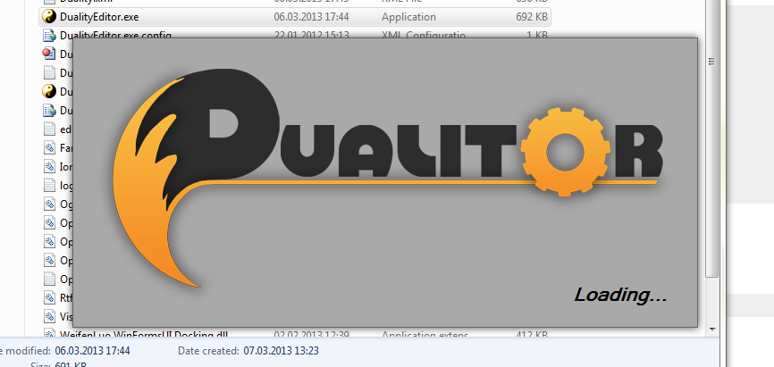</center>

# Setting up a Project

Each application handles its files and projects differently, but most of them detach project from application. Duality doesn't do that. Each project you set up comes with its own version of engine and editor and there is no central location in which the "Duality Editor Application" resides.

While this approach may sound ridiculous at first, there is a practical reason for it: Duality is still under development and backwards compatibility can not always be guaranteed. Looking at long term development, it can't be entirely ruled out that there are updates that will break projects set up in previous versions of Duality. By carrying its own version of engine and editor, each project will remain safely play- and editable. Although you can still update them manually, old projects can live on without issues.

A Duality project spans the folder in which editor and engine application are located, as well as all of its subfolders. Thus, the folder to which you've extracted the binary package during installation already _is_ a Duality project! It hasn't been set up specifically, but still: Nothing prevents you from developing your game right there. Duality also has a `File / New Project...` dialog that allows you to do some more advanced setup, but let's skip that for now.

# Editor Layout

There you are, sitting in front of your computer screen and staring at some grey-ish thing named Dualitor. What next? Where is the game content going to be? When do you get to write some code? What are all these areas and why are they _all empty?_ Well. May I Introduce?

<center>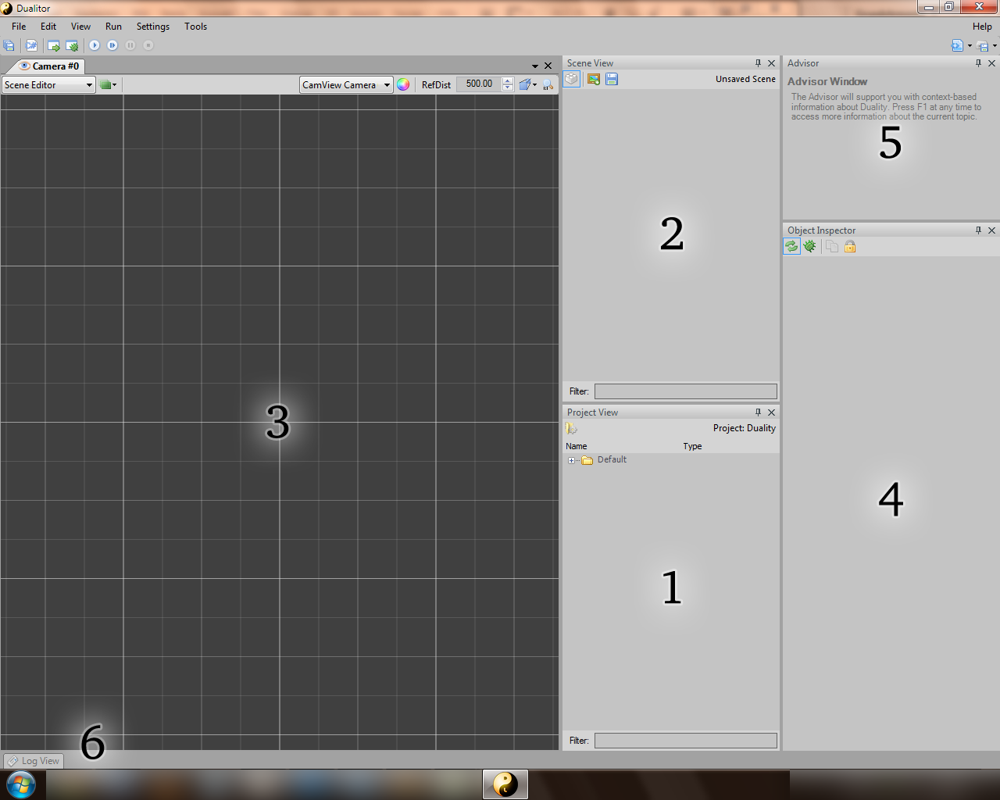</center>

1. **Project View:** This area is essentially a filtered file system browser rooted at your project's Data folder. In other words: This is where all your game content goes. It shows all the Resources your project has and the ones that are embedded in Duality itself. The latter ones are called `Default` and are always available.
2. **Scene View:** While the Project View deals with Resources, the Scene View deals with Gameobjects and Components. It shows the contents of the currently active Scene as a hierarchial scene graph.
3. **Camera View:** Shows the currently active Scene from a camera objects viewport. You can navigate by turning the Mouse Wheel or holding Middle or Right Mouse Button. Try it! If you don't quite get a feel for this kind of navigation, there is also an alternative set of camera controls: When holding the Space Bar, you can drag and turn the scene around using both Mouse Wheel and Left / Right Mouse Buttons. In the upper right of the Camera View, you can select a single Editing State and multiple View Layers. By default, the Scene Editor should be active, as well as the Grid Layer. Note that you can open as many Camera Views as you like, just select `View / Camera View`.
4. **Object Inspector:** As in most other applications, you will occasionally select objects. The Object Inspectors job is to show their properties and allow you to edit them. If you open multiple Object Inspectors using `View / Object Inspector`, selection changes will be split among them.
5. **Advisor:** Especially useful for beginners, the Advisors job is to provide helpful information about whatever your Mouse Cursor is currently hovering over. If you want to know what a specific Button, Property or Object does, try hovering over it and take a look at what the Advisor tells you. For more detailed information, press F1 while hovering over something - it will open an external help file whenever such topic is available. If you accidently close the Advisor, you'll find it under `Help / Advisor`.
6. **Log View:** Logging is a powerful debugging device and the Log View provides a clean look at what your game, engine and editor are writing to their logs. If expected errors occur, they will be logged. If unexpected errors occur, they will be logged as well. Ideally, both shouldn't happen - but you know how it is. The Log View helps you keep an eye on problems.


# Building a Scene

Time to get your hands on actual development. Let's start with something simple, a space shooter maybe. Space has the advantage of being completely empty, which naturally ressembles the state of a new project, so we're authentic right from the beginning. All we need to do now is fill the void with _stuff_. Here's a background and a space ship. Download them:

<center>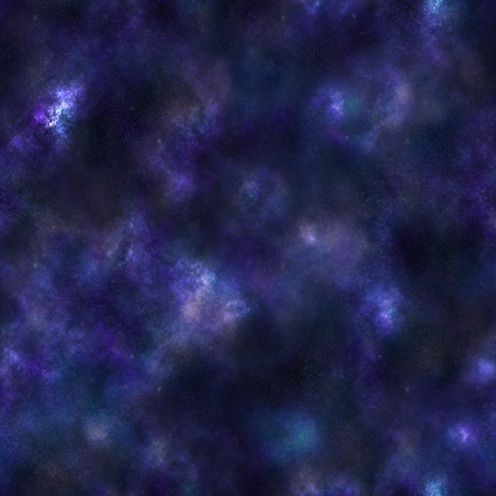</center>
<center>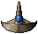</center>

Grab the image files you downloaded, drag them onto the Dualitor and drop them at the Project View. Two new **Pixmap** Resources will appear; Pixmap is short for _pixel map_ and represents an image as it has been imported into Duality's Resource file format. Resources are project-global data that represent your game's content. Note that, once imported, Resources are quite self-sufficient and never rely on external files to get their data from. You can safely delete the two files you downloaded and those Pixmaps just don't mind.

<center>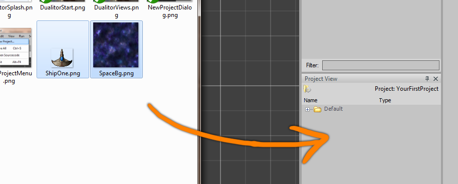</center>

However, Resources are just some static data and space certainly isn't filled with _data_. It's filled with objects, so let's construct some. Select the two Pixmaps in the Project View and dragdrop them onto the Camera View or Scene View. You will see two objects appear: A space ship and the background. You can move, rotate or scale them around in the Camera View.

<center>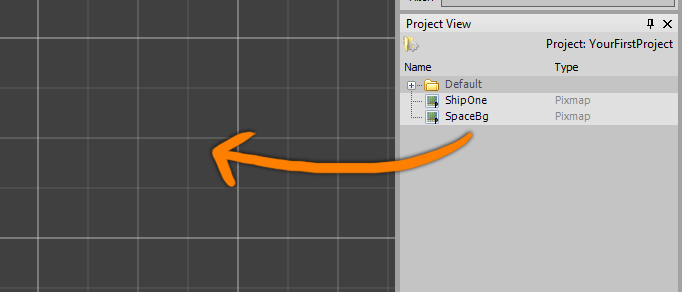</center>

Before proceeding we should take a closer look at what just happened. It was a single dragdrop action to create two Gameobjects from two Pixmaps, but Dualitor did a lot of things in the background to make that possible. First, look at the Project View: You'll notice that there now are six Resources instead of two! The thing is, plain, raw pixel data isn't sufficient for being used during the rendering process. It needs to be configured and transferred to the graphics card, which is what a **Texture** Resource represents. But a single Texture isn't enough either, since one might use multiple textures and additional data to display a single object. Describing how to display a single object is the job of **Material** Resources.

<center>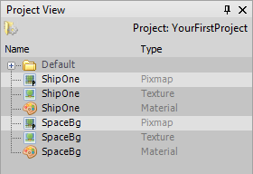</center>

When you dragged your newly created Pixmaps into the Scene or Camera View, Duality recognized that you were about to create some objects using them - so it quickly provided the appropriate Textures and Materials as well. You could have created them yourself beforehand, but since you didn't, Duality did. 

## Editing Gameobjects

Now take a look at the Gameobjects that have been created by your dragdrop action. They are displayed as yellow boxes in the Scene View. Expand them and you will see that each of those objects in fact seems to consist of two pieces: Transform and SpriteRenderer. 

<center>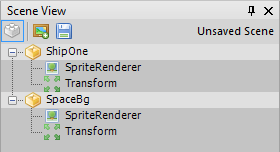</center>

These pieces are called Components and they are what all Gameobjects get their behavior and properties from. Each Component carries one single bit of functionality and cares for nothing else: **Transform** provides Position, Rotation and Scale properties to locate an object in space. **SpriteRenderer** displays an object as a sprite. A Gameobjects job is to take a group of distinct Components and pack them together into one entity, so the resulting objects are both located in space and rendered as a sprite. Since each Gameobject is composed dynamically, adding or removing functionality to existing objects is easy, as it purely depends on what Components it carries.

If you navigate through the current Scene (Remember: Mouse Wheel / Right Mouse Button) you will notice that both ship and background are placed on the same layer: The background doesn't really seem far away and it might even show up in front of the ship! That's not how it should look like, so let's change it. Select the `SpaceBg` Gameobject and the Object Inspector will display its properties, tabbed by Component. Open the Transform tab by clicking the plus sign on its left. Set the **Position** property to (0, 0, 9500). These coordinates describe the object's location in X (left to right), Y (top to bottom) and Z (near to far).

<center>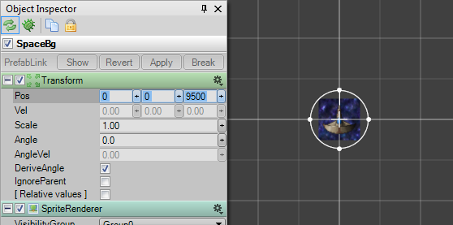</center>

When moving the Camera View now, the background has the appropriate distance but is far too small to cover our view. Set the **Scale** property to 25 in order to compensate. Move again to see if it looks good and adjust Position and Scale until you're content.

<center>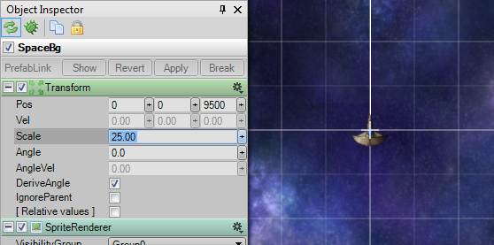</center>

To prevent us from accidently selecting, moving or scaling the background object from now on, right-click on it in the Scene View and select `Lock / Hide` object. This is a pure editor setting that will have no effect on the actual game environment. Locked objects will appear greyed out in the Scene View and cannot be selected by hovering or clicking inside the Camera View.

<center>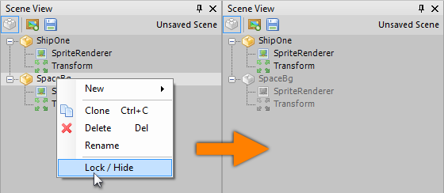</center>

## Physics and Collision Detection

After configuring the background, we should do the same for the player ship. Right now, it isn't different from the background object at all: A sprite located somewhere in space, not able to do anything useful. Our goal is to make it fly around based on user input. There are at least two methods to achieve that - both require some programming, but are based on different concepts:

1. In the first approach, we might just listen for user input and directly interfere with the Transform properties Position and Rotation, which is very easy to handle and allows us direct control over all the math behind player movement. This is good if we don't require physically "correct" behavior and don't want physics to interfere with the game code.
2. On the other hand, there is the physics-driven approach. Instead of doing the math ourselves, we can just define the object's physical shape and apply forces to it like a thruster would. The main advantage is flexibility towards physical object interaction and a believable collision response right from the beginning.

For this tutorial, we'll use the second approach. Right-click on the player ship Gameobject and select `New / Physics / RigidBody`. A RigidBody defines an object's shape and other physical properties like mass, friction or restitution. Rigid bodies can collide and interact with each other. Note that Duality physics is purely two-dimensional. An object's Z value is simply ignored during simulation.

<center>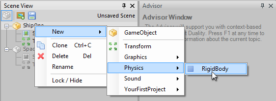</center>

By default, RigidBody Components assume a circular shape. Since our space ship isn't a ball, we should fix that. Click on the Camera View combobox that says `Scene Editor` and switch it to `RigidBody Editor`.

<center>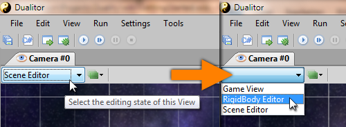</center>

You should see the ship object and an overlay that shows its physical shape - a circle. Select and delete it to make way for a more accurate representation. Now use the shape tools in the toolbar above to define a new shape. (Keep in mind that you can always zoom in using the Mouse Wheel.) It doesn't matter how many primitives you add or how you configure them - as long as they belong to a single RigidBody, they will act as one physical object.

However, there are two things to keep in mind:

1. By default, an object's mass is calculated based on the total area occupied by all of the primitive shapes. Overlapping shapes might make an object appear unusually heavy - you might want to avoid (or use) that. If you aren't content with the automatic mass calculation, you can always enter an explicit value in the respective RigidBody property.
2. Each shape adds a little complexity to the physical simulation. For performance reasons, you should always use the simplest shape that you can get away with. When defining polygons, each edge adds complexity. Circles are generally easiest to calculate but aren't always suitable.

<center>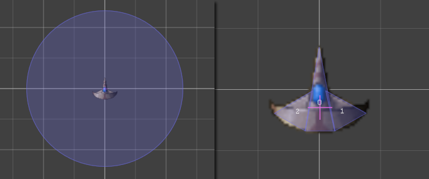</center>

## Testing the Scene Setup

After defining the ship's shape, be sure to switch back to the Scene Editor mode. Let's see what happens when we run the game. In Duality, you don't need to actually run the game to see that: The editing environment has a built-in testing mode called **Sandbox**, which allows you to see the game in action while at the same time being able to use full editing functionality. The current Scene's state is saved when entering the Sandbox and restored after exiting it. However, the current Scene has never been saved anywhere, so we better do it now. Click on the `Save Scene` button in the Scene View and a new Scene Resource will appear in the Project View. Enter a suitable name and hit return to accept.

<center>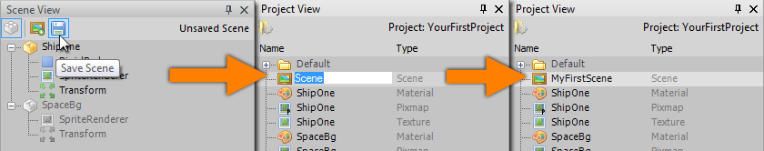</center>

The current Scene is now safely stored in the Resource file that you've just named. A **Scene** Resource represents a single level or stage of your game. When double-clicking a Scene Resource in the Project View, it will be opened for editing. You don't need to do that now, because the Scene you just saved is still open. Let's see what happens when entering the Sandbox. Click `Enter Sandbox mode` in the toolbar and watch. _Here's a hint: Zoom out a little before you do it._

<center>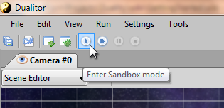</center>

As you will notice, the ship falls down. Why? Because by default, Duality applies gravity to all physical objects. In space, however, there shouldn't be any gravity. To fix that, exit the Sandbox mode (This is important - otherwise, your changes will be reset after doing so later on), select the Scene Resource in the Project View and adjust its **GlobalGravity** property to (0, 0). When you hit Play again, the space ship will no longer fall down. 

The Sandbox is a good way to test how certain things behave when running the game, and you can use all of Dualitor's editing functionality during debug sessions. You can even go one step further and actually play the game inside the editor. The Camera View has a special mode for that. It's called `Game View` and can be selected the same way you selected the `RigidBody Editor` before. However, we don't want to lose the Scene Editor so it'll be best to open a second Camera View. Click on `View / Camera`. 

<center>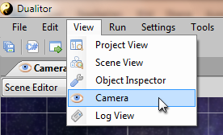</center>

A new Camera View will open tabbed to the existing one. Grab the tab and and drag it onto the bottom of the screen to lay them out next to each other.

<center>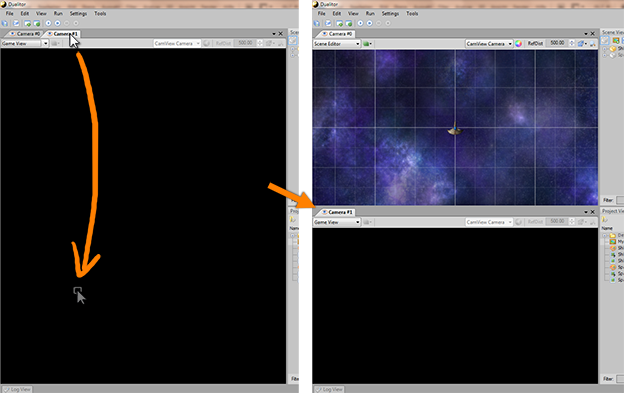</center>

Now that we have both views aligned vertically, switch the new one from `Scene Editor` to `Game View`. It will now show you the current Scene view the same way it would when running the game. But why is it _all black?_ Did we miss something?

Yes, we actually did: While each Camera View provides its own internal Camera object to observe the Scene for editing purposes, we never created an actual Camera object for the game itself. When using the `Game View` mode, we see the Scene through the eyes of its observer - but there is none! Only the two Gameobjects for player ship and background, but neither of them carries a Camera Component. So let's create a Camera object for our Scene.

<center>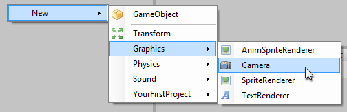</center>

Right-click on an empty spot in the Scene View and select `New / Graphics / Camera`. You will notice that the Game View now shows our background image, but not the space ship. That's because it is too near to be seen. Select the newly created Camera object and set its Position to (0, 0, -500). You should now see both background and space ship in the Game View. 

<center>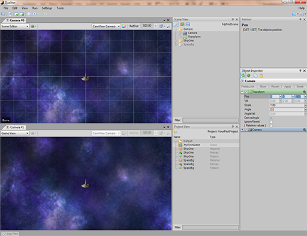</center>

To be complete, right-click on the Camera Gameobject in the Scene View and select `New / Sound / SoundListener`. This will allow our Camera object to not only receive visuals, but also audio of any kind. 

<center>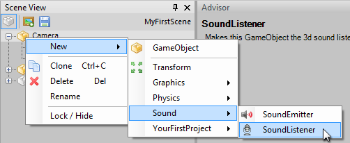</center>

# Writing Code

Enough with all the preparations. Time to write some code! Click on the `Open Sourcecode` button in the upper left to bring up Visual Studio with the game plugin project open. While other game frameworks are referenced and used by your own code, Duality does the reverse: In a Duality game, it's not your code that is using the engine - the engine is using your code! Every custom Component, each and every feature you implement is compiled to a Plugin .dll file, which Duality will load and use as it sees fit. The Visual Studio solution that is opened using that button contains a new project that is a fully configured Duality Plugin - ready to be filled with your code.

<center>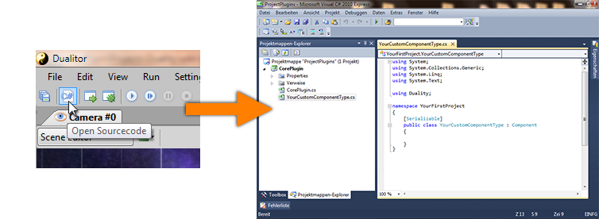</center>

In the Solution Explorer you will see two code files are already part of the project: `CorePlugin.cs` and `YourCustomComponentType.cs`. The first one identifies your Duality plugin and provides an interface for global logic. For now, leave it alone. Instead, rename `YourCustomComponentType.cs` to `Player.cs` and do the same to the class that is defined within this file. Open it and you should see the following code:

```csharp
using System;
using System.Collections.Generic;
using System.Linq;

using Duality;

namespace YourFirstProject
{
    public class Player : Component
    {

    }
}
```

It defines a class named Player that derives from the Component base class. This is the primary way to introduce new logic to Duality: By defining custom Components that can then be added to Gameobjects in the editor. Let's implement some basic player ship logic step by step:

1. First add `using` directives for the namespaces `Duality.Components.Physics` and `Duality.Input`. That way we won't have to call all those classes we'll be using by their full name.
2. Right before the `Player` class definition, add a new `[RequiredComponent(typeof(RigidBody))]` attribute. This will tell engine and editor that our player logic will always require its Gameobject to also have a RigidBody. We'll need it to apply user input forces to it.
3. Let Player not only derive from `Component`, but also implement the `ICmpUpdatable` interface. It will allow us to do one update per frame cycle by providing a suitable method definition. Your class definition line should look like this: `public class Player : Component, ICmpUpdatable`.
4. Click on `ICmpUpdatable` and a tiny blue square will appear to its left. When hovering over it, a context menu will appear. Open it and select `Implement interface explicitly`. Visual Studio will add some lines of code for you. Remove `throw new NotImplementedException();` from its body so we can insert our own implementation.
5. Before checking user input or applying forces, we'll need to retrieve the RigidBody Component to work on. The best way to obtain a reference to it is to ask our Gameobject: `RigidBody body = this.GameObj.GetComponent<RigidBody>();`.
6. Now that we are prepared, we can check for user input. `if (DualityApp.Keyboard[Key.Left])` (If the player presses the left key), `body.ApplyLocalForce(-0.001f * body.Inertia);` (apply a small counter-clockwise rotation force). By multiplying that force with the bodies rotational mass / inertia, we get a similar acceleration for bodies of different masses or sizes.
7. Implement the same for the right key and a small clockwise rotation force.
8. If neither the left nor the right key is pressed, we want the ongoing rotation to stop: `body.AngularVelocity -= body.AngularVelocity * 0.1f * Time.TimeMult;`. Each frame, a tenth of the current velocity is subtracted. We'll need to multiply that value by `Time.TimeMult` to account for Duality's variable time step: Not all frames take the same amount of time. A game might run fast on one machine (many frames per second) and slow on the next (few frames per second). To be sure that the underlying logic always executes at the same speed, there is `Time.TimeMult` to compensate: At 60 FPS, it will equal exactly `1.0f`, leaving all calculations as they are. If we run at 120 FPS (i.e. twice as fast), it becomes `0.5f` so each frame is doing half the work and everything adds up roughly the same it does at 60 FPS. When running at 30 FPS (half as fast), it will be `2.0f` to compensate in the other direction. You get the idea.
9. Check for more user input! `if (DualityApp.Keyboard[Key.Up])` (If the player presses the up key), `body.ApplyLocalForce(Vector2.UnitY * -0.2f * body.Mass);` (apply a small local upward force). Like above, by multiplying that force with the bodies mass, we prevent the movement from behaving different for differently weighted objects: For heavier object we simply apply more force, for lighter ones less.
10. Implement the same for the down key and a small local downward force.

By now, your custom Player Component should look something like this:

```csharp
using System;
using System.Collections.Generic;
using System.Linq;

using Duality;
using Duality.Components.Physics;
using Duality.Input;

namespace YourFirstProject
{
    [RequiredComponent(typeof(RigidBody))]
    public class Player : Component, ICmpUpdatable
    {
        void ICmpUpdatable.OnUpdate()
        {
            RigidBody body = this.GameObj.GetComponent<RigidBody>();

            if (DualityApp.Keyboard[Key.Left])
                body.ApplyLocalForce(-0.001f * body.Inertia);
            else if (DualityApp.Keyboard[Key.Right])
                body.ApplyLocalForce(0.001f * body.Inertia);
            else
                body.AngularVelocity -= body.AngularVelocity * 0.1f * Time.TimeMult;

            if (DualityApp.Keyboard[Key.Up])
                body.ApplyLocalForce(Vector2.UnitY * -0.2f * body.Mass);
            else if (DualityApp.Keyboard[Key.Down])
                body.ApplyLocalForce(Vector2.UnitY * 0.2f * body.Mass);
        }
    }
}
```

That's all we need for now. Right-click on the `CorePlugin` project (not the .cs file) in the Solution Explorer and select `Build` to compile the Plugin. Now switch back to the Dualitor - it will notice that you recompiled and automatically reload the Plugin. Now right-click on the player ship Gameobject in the Scene View and select `New / YourFirstProject / Player`. Enter the Sandbox mode. Fly using the arrow keys.

# Run, Debug and Publish

Running your game in the editor is fine as a first test - but sooner or later, you'll want to publish your game, or run it as a standalone application. That application is called **`DualityLauncher.exe`** and is also available through the editor UI. Click on the `Run Game` button in the toolbar.

![Run Game Button][RunGameButton]

You will see a Console window popping up (this won't show up when running outside the editor), followed by your game (it runs windowed). After a few moments of tense anticipation, you will see.. nothing. Black emptiness. Why doesn't it show the Scene we just tested in the editor? Easy: Because we never told it to do so. In general, Duality applications can be configured in various ways: While `UserData` holds anything you'd expect to appear in a games Options or Setup menu, there is also the so called `AppData` which carries everything else: Version numbers, author names, universal constants - and the starting Scene. To assign our new Scene as starting Scene, click on `Settings / Application Data`.

![Edit App Data][EditAppData]

Then, grab our test Scene Resource from the Project View and drag it onto the `StartScene` property in the Object Inspector. When clicking `Run Game` again (or running `DualityLauncher.exe` manually), you should see the test Scene and be able to fly around using your space ship. In case you want to do it in fullscreen mode, click on `Settings / Default User Data` and set the `GfxMode` property to `Native`. _Beware: We didn't yet implement any way to end the game, so you'll probably need the task manager to shut down the game from fullscreen._

There is also a third way to run the game and it is especially useful for debugging: Switch to Visual Studio and click `Start Debugging` or press `F5`. Not only will it run the game as standalone application, it will also attach the debugger. Try it! Set a breakpoint in your custom Player Component code and step through it.

![Debug Game Break][DebugGameBreak]

If you use the Professional or Community version of Visual Studio, you can also attach the debugger manually - to both the standalone app and the editor.

To get your game ready for deployment and provide a download for others, select the `File / Publish Game` option that will create a folder or `.zip` file containing your game and, if you want to, the editor and / or source code as well.

Although it might be tempting to hide both source code and game Resources from public access, delivering either of them is highly encouraged! Everyone who plays your game will be able to create mods using the same tools you had - which will be a great contribution to your game's community.

# What next?

If you're reading this, you've probably completed this tutorial. So far so good - but what you've got is hardly a game. There may be a lot of open questions, more than a quick intro article like this can cover. How to proceed? First of all, there is the integrated help system (called "Advisor", as you may recall) and the API reference you can invoke via F1 or by opening `DDoc.chm` from the Duality installation package. It explains a lot of vital concepts and may prove to be a helpful source of information. When encountering problems that you can't seem to solve by yourself or just want to ask some questions, a visit to the [Duality forums][DualityForums] might pay off, especially the [tutorial section][TutorialSection] where you can find a lot of other sources for learning.

Other than that - learning by doing is a really powerful concept and Duality does its best to nudge you in the right direction. Explore the possibilities. Click all the buttons and use all the API methods. Create a game prototype. Even better: Create a lot of game prototypes. And most importantly: Have fun! :)

[RunGameButton]: ../../img/GettingStarted/RunGameButton.png
[EditAppData]: ../../img/GettingStarted/EditAppData.png
[DebugGameBreak]: ../../img/GettingStarted/DebugGameBreak.png

[DualityForums]: http://forum.adamslair.net/
[TutorialSection]: http://forum.adamslair.net/viewforum.php?f=17