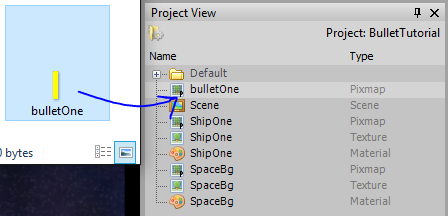
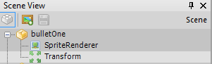
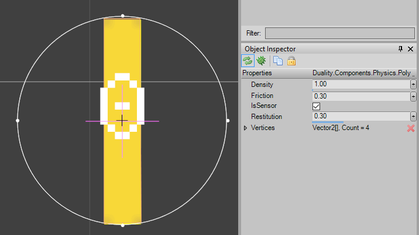
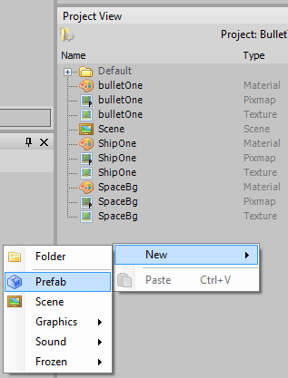
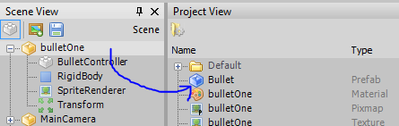
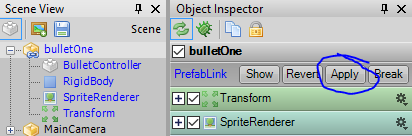
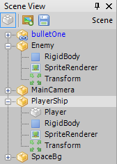

Creating and handling bullet like objects is a common game requirement that often causes people trouble. It can be done in a variety of ways, and which way is best depends on your specific game, performance concerns, and style. This is simply one way of approaching this problem.

# Project Setup

This tutorial's examples are going to expand upon the Getting Started tutorial [here](getting-started.md). Nothing will prevent you from starting with your own project, but it will be easier to follow along if you start with that tutorial. If you are starting from your own project, all you will need is a GameObject to act as your shooter.

# Creating the Bullet

First, lets get a sprite into Duality to use for our bullet:


Save this image and then drag it onto the project view in the Duality editor:



Now drag the Pixmap created in the project view into the scene editor to automatically create a GameObject in the scene. This GameObject will automatically have a SpriteRenderer and Transform component:



## Rigidbody

Add a Rigidbody component to the BulletOne GameObject (Right Click -> New -> Physics -> Rigidbody). Now enter the Rigidbody editor, select the BulletOne's Rigidbody, and replace it's default circle shape with a rectangle surrounding the image. 
Select the rectangle shape you just made and in the Object Inspector window check the "IsSensor" box. What this does is make the physics system notify us when the bullet collides with another rigidbody, but without resolving collisions. What this means is the bullet will not affect the movement of the object it hits, or end up ricocheting. Now we obviously don't want bullets to just pass through the objects they hit, but we will handle this later.
Checking the "IsSensor" box turns the shape in the Rigidbody editor an orange color. In the end, things should look like this:



## BulletController Component

Now we need to code a Component to handle the bullets logic. So, open your game's CorePlugin project (click the "Open SourceCode" at the top-left of the editor) and create a new Component called BulletController. This component is going to implement three interfaces: ICmpUpdatable, ICmpInitializable, and ICmpCollisionListener. After creating some empty methods for the interfaces, your BulletController class should look as follows:

```csharp
public class BulletController : Component, ICmpUpdatable, ICmpInitializable, ICmpCollisionListener
{
    public void OnInit(InitContext context)
    {
    }
    public void OnUpdate()
    {
    }
    public void OnShutdown(ShutdownContext context)
    {
    }
    public void OnCollisionBegin(Component sender, CollisionEventArgs args)
    {
    }
    public void OnCollisionEnd(Component sender, CollisionEventArgs args)
    {
    }
    public void OnCollisionSolve(Component sender, CollisionEventArgs args)
    {
    }
}
```

Now let's go over what each of these methods is for and how we are going to use them:

* OnInit: This is for any initialization that need's be performed for a Component. We will be using this to cache some other Component's on our GameObject. Doing so is optional, but is slightly faster than retrieving the Component each time we need it. We will also use this to play a sound when the bullet is fired. More on that later.
* OnUpdate: This is called once per frame to update the Component. We will be using this to monitor the lifetime of our bullet.
* OnShutdown: This is used for any cleanup code that needs to run when an Component is removed from an object. We wont be using this.
* OnCollisionBegin: This is called when two Rigidbodies first come in contact with each other. I will show you how to use this to spawn a visual effect and destroy the bullet.
* OnCollisionEnd: This is called when two previously in-contact Rigidbodies move out-of-contact. We wont be using this.
* OnCollisionSolve: This is called each frame after the physics system solves for the RigidBody collision. It's important to note that this is only called when RigidBody shapes collide that are not sensors. So, in the case of our bullet, this will never be called. Not used.

First thing we are going to do is get this bullet moving. To do this, we will need access to the Bullet's Transform and Rigidbody components, so lets get those is the OnInit method as follows:

```csharp
private Transform m_Transform;
private RigidBody m_RigidBody;

public void OnInit(InitContext context)
{
    if (context != InitContext.Activate) return;
    m_Transform = GameObj.GetComponent<Transform>();
    m_RigidBody = GameObj.GetComponent<RigidBody>();
}
```

Notice, we check to make sure that OnInit is being called due to the activation of this Component. This is almost always when you want to perform your initialization code.
Right now, our BulletController Component is assuming that the GameObject it is attached to has a Transform and RigidBody attached to it. Lets make sure of that by adding the following to the class declaration line:

```csharp
[RequiredComponent(typeof(Transform)), RequiredComponent(typeof(RigidBody))]
public class BulletController : Component, ICmpUpdatable, ICmpInitializable, ICmpCollisionListener
```

Now to get the bullet moving we just need to set it's velocity in the OnUpdate method and add a "Speed" property:

```csharp
public float Speed { get; set; } = 30f;

public void OnUpdate()
{
    m_RigidBody.LinearVelocity = Vector2.FromAngleLength(m_Transform.Angle, Speed);
}
```

Now let's test it. First, rebuild your solution (in Visual Studio click Build -> Rebuild Solution) and then switch back to the Duality editor. Add a BulletController Component to the BulletOne GameObject (Right Click -> New -> "Your Project Name" -> BulletController). Now you should be able to enter Sandbox Mode and see your bullet zooming away. Look at it go.... forever.... lets fix that.

## Bullet Lifetime

We don't want our bullet to fly forever, just sufficiently long enough to hit anything relevant. To do this, we need two more variables in our BulletController Component:

```csharp
private float m_LifetimeCounter;

public float LifeTime { get; set; } = 100f;
```

And now we just increment our counter in OnUpdate. When it exceeds LifeTime, we remove the parent GameObject from the scene:

```csharp
public void OnUpdate()
{
    m_RigidBody.LinearVelocity = Vector2.FromAngleLength(m_Transform.Angle, Speed);
    m_LifetimeCounter += Time.TimeMult;

    if (m_LifetimeCounter > LifeTime)
    {
        //GameObj is a reference to this Components parent GameObject
        Scene.Current.RemoveObject(GameObj);
    }
}
```

Now rebuild your solution, switch to the Duality editor, and enter the Sandbox. After a few seconds of your bullet flying into the distance, you should see it disappear from your Scene View. When out of the Sandbox mode, you can adjust the LifeTime value if you select the BulletController component.

Now we need to look into how to shoot these bullets with user input.

# Firing a Bullet

Having one bullet flying through our scene is fine and dandy, but we need to shoot these things on demand! How will we do this. First, we need to make a Prefab. What is a Prefab? Think of it as a blueprint from which we can create or **instantiate** multiple GameObjects. To create one, go to your Project View in the Duality editor then Right Click -> New -> Prefab:



**_Before continuing, verify that the BulletOne Transform has Pos (0,0,0)_**

Name it Bullet. Now go to your Scene View and drag-and-drop your BulletOne GameObject onto the Prefab in the Project View:



After doing so, you should see the BulletOne GameObject turn blue in the Scene View. This is your reminder that the GameObject is **linked** to a Prefab.

A note about Prefabs before we continue. Although GameObjects made from Prefabs are instances of the Prefab, edits made to the GameObject instance are not automatically made to the Prefab. In order to change a prefab, you must edit an instance in the Scene View and then click the "Apply" button in the Object Inspector:



Now we are going to have to edit our Player Component from the Getting Started tutorial. If you using your own project rather than the one from the tutorial, no worries. All the Component does right now is move a ship around, and that code is irrelevant to us right now. Just apply these edits to some kind controller Component on the objects you want to be able to shoot.

Edit the Player Component like so:

```csharp
public ContentRef<Prefab> BulletPrefab { get; set; }

void ICmpUpdatable.OnUpdate()
{
    if (DualityApp.Keyboard[Key.Space] && BulletPrefab != null)
    {
        Transform transform = GameObj.GetComponent<Transform>();
        GameObject bullet = BulletPrefab.Res.Instantiate(transform.Pos, transform.Angle);

        Scene.Current.AddObject(bullet);
    }

    /*
    * Ship Movement code
    */
}
```

We check to see if the Spacebar is pressed. If it is, we instantiate the BulletPrefab at the Player position and angle, and then add it to the scene. If you are wondering about the `ContentRef<>` property, just think of it as a safe way to hold references to game resources: It's just a variable that points to the Resource you want to use. By default, it doesn't point anywhere and will return `null` when accessed. However, as soon as you recompile your game plugin, the property you defined will show up in the Object Inspector tab of your object, allowing you to assign a Resource of your choice in a simple dragdrop operation from the `Project View` into the property in the `Object Inspector`. 

_For more information on `ContentRef<>` and Resource management, see the [Working with Resources](https://github.com/AdamsLair/duality/wiki/Resource) tutorial._

Notice that we are looking for a Transform component, but we have no guarantee that it is there. So, edit the Player class declaration to appear as follows:

```csharp
[RequiredComponent(typeof(RigidBody)), RequiredComponent(typeof(Transform))]
public class Player : Component, ICmpUpdatable
```

Now rebuild the solution, return to the Duality editor, and enter Sandbox mode. If you press space, you should see a stream of bullets created. Woohoo! But, we need to slow down this shooting. So, much like we did with the Bullet to manage it's lifetime, lets add in a counter to the Player Component OnUpdate method:

```csharp
private float m_FiringDelayCounter;

public ContentRef<Prefab> BulletPrefab { get; set; }

public float FiringDelay { get; set; } = 10f;

void ICmpUpdatable.OnUpdate()
{
    m_FiringDelayCounter += Time.TimeMult;
    if (DualityApp.Keyboard[Key.Space] && BulletPrefab != null 
            && m_FiringDelayCounter > FiringDelay)
    {
        m_FiringDelayCounter = 0;
        Transform transform = GameObj.GetComponent<Transform>();
        GameObject bullet = BulletPrefab.Res.Instantiate(transform.Pos, transform.Angle);

        Scene.Current.AddObject(bullet);
    }

    /*
    * Ship Movement code
    */
}
```

Rebuild, go to Dualitor, enter Sandbox, and test. Play with the FiringDelay until it's something you like.

# Bullet Collisions

We've made it pretty far. The last major feature we need is bullet collisions. Before we start, here are some common problems people run in to when implementing bullets:

1. Bullets are spawned inside of their Player, colliding with the player.
2. How do we spawn visual effects or play sound effects? I won't go indepth on these issues, but I will show you how to do it briefly.

Before we can implement collisions, we need something for our bullets to collide with. If you're using the project from the Getting Started tutorial just right click on the player ship in the Scene View and hit clone. Rename the clone to "Enemy" and delete the Player Component. Edit the Enemy's Transform until it is a good distance from the Player ship. Your Scene View should look something like this:



Now to deal with issue (1) from above, we will do two things. Technically, either one of these is sufficient to solve the problem, but doing them both gives us more control and has other uses.

First, add a Creator property to the BulletController Component:

```csharp
public class BulletController : Component, ICmpUpdatable, ICmpInitializable, ICmpCollisionListener
{
    private Transform m_Transform;
    private RigidBody m_RigidBody;
    private float m_LifetimeCounter;

    public float LifeTime { get; set; } = 100f;
    public float Speed { get; set; } = 30f;
    public GameObject Creator { get; set; }
```

And in the Player Component, after instantiating the bullet, get a reference to it's BulletController component and set the value of the Creator field:

```csharp
void ICmpUpdatable.OnUpdate()
{
    m_FiringDelayCounter += Time.TimeMult;
    if (DualityApp.Keyboard[Key.Space] && BulletPrefab != null 
            && m_FiringDelayCounter > FiringDelay)
    {
        m_FiringDelayCounter = 0;
        Transform transform = GameObj.GetComponent<Transform>();
        GameObject bullet = BulletPrefab.Res.Instantiate(transform.Pos, transform.Angle);

        BulletController bulletController = bullet.GetComponent<BulletController>();
        bulletController.Creator = GameObj;

        Scene.Current.AddObject(bullet);
    }
    /*Other Player.OnUpdate Code below*/
}
```

Now in the OnCollisionBegin method of the BulletController component we need to make sure that the collision is not with the Bullet's creator. Furthermore, we don't want to respond to the collision if the collision is with a shape of a Rigidbody marked "IsSensor". Once these issues are taken care of, we can remove the Bullet from the scene.

```csharp
public void OnCollisionBegin(Component sender, CollisionEventArgs args)
{
    //Do not collide with whatever created the bullet
    if (args.CollideWith == Creator) return;

    //We cast to RigidBodyCollisionEventArgs to get access to the info about the shapes involved.
    var rigidBodyArgs = args as RigidBodyCollisionEventArgs;
    if (rigidBodyArgs != null && rigidBodyArgs.OtherShape.IsSensor) return;

    Scene.Current.RemoveObject(GameObj);
}
```

Second, let's spawn bullets at an offset from the Player:

```csharp
public Vector3 FiringOffset { get; set; } = new Vector3(0, -40, 0);

void ICmpUpdatable.OnUpdate()
{
    m_FiringDelayCounter += Time.TimeMult;
    if (DualityApp.Keyboard[Key.Space] && BulletPrefab != null 
            && m_FiringDelayCounter > FiringDelay)
    {
        m_FiringDelayCounter = 0;
        Transform transform = GameObj.GetComponent<Transform>();
        GameObject bullet = BulletPrefab.Res.Instantiate(transform.Pos + 
                            transform.GetWorldVector(FiringOffset), transform.Angle);

        BulletController bulletController = bullet.GetComponent<BulletController>();
        bulletController.Creator = GameObj;

        Scene.Current.AddObject(bullet);
    }
    /*Other Player.OnUpdate Code below*/
}
```

FiringOffset is a vector relative to the Player itself, so we call transform.GetWorldVector to account for scale and rotation of the Player's Transform. This offset can be used to move the bullet out of the shooters rigidbody to prevent bullets colliding with the shooter. Although that works, it can look weird to have bullets spawn in front of the shooter, rather than coming out of the gun/ship/whatever. So, we really are using this to have the bullet spawn at a certain location for visual purposes, but just know that it can handle the collision issue we are addressing.

If you rebuild and go to the sandbox.... you'll still have collision issues. Don't worry. This is an issue with the accuracy of the Physics when ran from the Duality Editor. If you run the Game from Visual Studio with Ctrl+F5, you will have no issues.

# Sound/Visual Effects

And now to briefly touch on Sound/Visual effects.

For Sound, add a ContentRef<Sound> property to your BulletController, and in OnInit, use DualityApp.Sound.PlaySound. As far as getting the sound into Duality, you'll want a .ogg sound file, and then move it into Duality just like you would a Sprite. BulletController edit's will look like this:

```csharp
public ContentRef<Sound> Sound { get; set; }

public void OnInit(InitContext context)
{
    if (context != InitContext.Activate) return;

    if (Sound != null)
    {
        DualityApp.Sound.PlaySound(Sound);
    }
    m_Transform = GameObj.GetComponent<Transform>();
    m_RigidBody = GameObj.GetComponent<RigidBody>();
}
```

This will play a Sound whenever the bullet is fired. If you want a sound when the bullet collides, the best way I have found is to have a Prefab that handles the visual effects, and in the prefab's OnInit method, play the sound, as in the BulletController's shooting noise.

To spawn visual effects, edit BulletController as follows:

```csharp
//Add this up with the rest of your properties
public ContentRef<Prefab> OnCollisionPrefab { get; set; }

public void OnCollisionBegin(Component sender, CollisionEventArgs args)
{
    //Do not collide with whatever created the bullet
    if (args.CollideWith == Creator) return;

    //We cast to RigidBodyCollisionEventArgs to get access to the info about the shapes involved.
    var rigidBodyArgs = args as RigidBodyCollisionEventArgs;
    if (rigidBodyArgs != null && rigidBodyArgs.OtherShape.IsSensor) return;

    //Spawn Prefab as needed
    if (OnCollisionPrefab != null)
    {
        var onCollideInstance = OnCollisionPrefab.Res.Instantiate(m_Transform.Pos);
        Scene.Current.AddObject(onCollideInstance);
    }

    Scene.Current.RemoveObject(GameObj);
}
```

# Conclusion
Hopefully, this tutorial was helpful for you. While this method of implementing bullets is certainly not the best in all situations, it will work in many instances and is a good starting point at the very least.