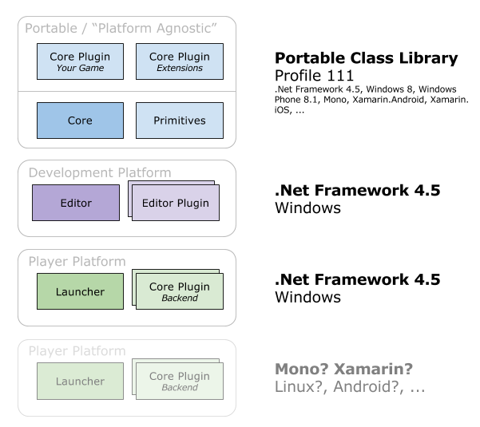

This page provides a basic overview on the Duality framework.

# General

_**ToDo:** Provide a basic overview on the Core / Launcher / Editor distinction_

_**ToDo:** Differences between Core and Editor plugins_

# Portability

Starting with Duality v2.0, the framework has been restructured to make porting Duality to different platforms a lot easier. Instead of officially porting and supporting Duality on X different platforms, the main goal here is to let you do the porting for the platform you need, but prepare everything in a way that takes the agonizing part of that work off your shoulders. You know your target platform - we know Duality. So let's split up and each do what we are best in doing.

> **Note:** The following describes the _idea_ behind the portability changes in v2.0. As long as no attempts are made by users to _actually_ port Duality, i.e. use the API that is described here, it would be wise to expect unexpected pitfalls or rough edges - and of course, the devil is always in the details. **Don't** expect magic. **Do** expect a setup that was designed with portability in mind.

A major effort for the Duality v2.0 release was cutting all the dependency ropes that usually make porting such a tedious task. Both the Duality Core and all Core Plugins - including your own game code and third-party engine extensions - are now (non-shim) Portable Class Libraries and thus, to a degree, platform-agnostic. They simply don't care which platform they're run on and don't need to be ported at all.

* You don't need to port your game code.
* You don't need to port Duality itself.

In order to achieve this level of portability, all platform-dependent backend code has been put behind an abstraction layer. When running the **Duality Launcher**, it provides the core with an interface to enumerate and load the available plugins. The Core then uses that interface to load so-called **Backend Plugins** (which are in fact just Core Plugins that happen to contain implementations for backend interfaces), which provide everything the Core needs to run your game. This means that all you need to do to run Duality on a new platform is:

* Implement a Launcher on your target platform.
* Implement a Backend Plugins on your target platform.

Here's the deal you get with Backend Plugins and a custom Launcher:

* You get a well-defined, modular interface API by the Duality Core. Your job is to implement it.
* You get an implementation sample by taking a look at the default backend and launcher.
* No need to fork the Core, make changes to it or take a deep-dive into its implementation.
* When the Core gets upgrades, you get all the upgrades as well, no need to manually merge them. The Core is distinct from your backend implementation. _Exception: The Backend API changes during a major version step. In that case, you'll have to adjust to that._
* You can use third-party Core Plugins and they can follow you on new target platforms. _Exception: They deviated from the (default) path of being PCLs and chose to depend on a specific target framework._

Porting is probably still a lot of work. You'll need to address each platform's quirks, performance gaps, all the usual. But starting with v2.0, Duality now does it's best to not get in the way and make this as easy for you as possible.

_**ToDo:** Describe different backend APIs and their purpose_