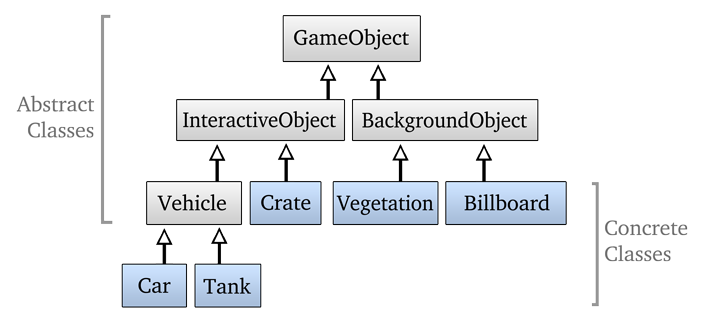
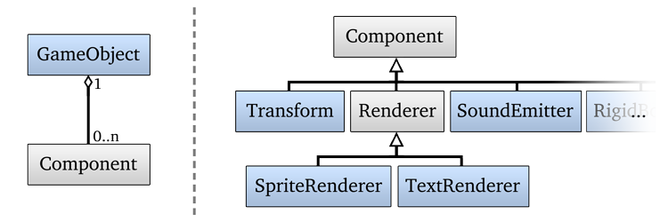

In a component-based gameobject system like the one used in Duality, most objects are represented by a multitude of Components. GameObjects are what glues them together, providing a context and mutual base for each of them. This article should explain the basic principles behind the system.

# Overview

So, what is a component-based gameobject system? It's easier to begin with what it's _not_: A "classic" approach on modelling object classes and behaviours is some kind of inheritance tree that might look like this:

Its structure depends on the games actual needs. Tanks and Cars make noise, so they're likely to need some kind of sound emitting logic. As they're both vehicles, we may directly implement the sound-emitting logic in Vehicle.

"Well", says the experienced programmer, "a crate might also be noisy", so he has to move the audio logic up again: It is now located in any InteractiveObject. But what if we, one day, want to have a Billboard that can also make noises? Or a talking plant? The more flexible we want to be, the more logic travels upwards on the inheritance tree. In worst case, GameObject gets crowded with specialized logic because any object might need some of it one day. One step later, you will ask yourself why you maintain an inheritance tree at all.

To be utmost flexile, why not implement _all_ the logic in GameObject? That sounds really bad. No object will actually use all of the existing functionality. In fact, most objects will only use a very small potion of it. There must be a way to split the GameObjects logic into small, isolated chunks and handle them properly. Well, and here we are: This is what component-based gameobjects are all about.

The idea behind it is that a GameObject is nothing more than a container and manager of Components. Each Component handles a chunk of specific logic and we are free to compose a GameObject out of any combination of Components at runtime. Here's a list of reasonable examples to give you a more concrete idea of it:

  * **Transform**: The objects position, rotation and scale in the scene
  * **Renderer**: Abstract component that handles the objects visual representation. _Requires Transform._
  * **Camera**: Renders the scene from the objects point of view. _Requires Transform._
  * **SoundEmitter**: Emits a sound at a specific position in space. _Requires Transform._

To avoid ambiguity trouble, a GameObject may in general only contain one Component of each type. 