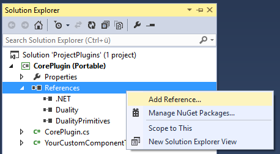

This article will outline how to use both internal and external libraries in your Duality game or editor plugin, as well as the details of what works and doesn't work.

# Adding a Reference

In general, when you want to use a (managed) library in your game plugin, you will have to add a reference to it in Visual Studio. To do that, open the Solution Explorer, expand your project item and right-click on the References child item in order to select "Add Reference". In the dialog, click "Browse" and select the library you want to reference.

If you're familiar with it, you can also use the Visual Studio integrated version of NuGet and add your dependency as a package - though it is advised not to do that for Duality plugin packages specifically, since they are already handled by Duality itself.

Depending on the type of library you're referencing, you may need to take care of some additional things. Being able to compile your game plugin with the new reference is one thing, making sure Duality is able to locate it at runtime is another one.

# Library Types

There are various kinds of libraries that you can use with Duality, some of them with different requirements than others.

## Duality Plugins

In the easiest case, you simply want your game plugin to reference another Duality plugin. Just use the "Add Reference" dialog and browse into the Plugins folder of your Duality project to select the plugin you need, and that's it. No additional steps required.

However, you should be careful not to mix core and editor plugins. While an editor plugin can reference whatever it wants, a core plugin should never rely on an editor plugin - otherwise, your game would depend on the presence of an editor, rendering the launcher application non-functional.

## Managed Libraries

You can reference managed libraries that are not Duality plugins as well, same procedure as above. In order to make sure that the Duality runtime is able to locate your referenced library, put it into the Plugins folder, right next to your game plugin. In most cases, that's all you need to know.

### Portability and (non-) Portable Class Libraries

By default, Duality game plugins are [Portable Class Libraries](Framework-Structure.md), which means that they limit themselves to a subset of the .Net Framework that is known to be portable across a range of platforms. To keep this contract intact, you can only reference libraries that use a similar or smaller subset of .Net, thus retaining portability.

There may be cases where this gets in the way, or you simply don't care about other platforms. In this case, just [convert](http://stackoverflow.com/q/20094075/2015377) your game plugin project to be a non-portable / regular C# class library and reference your dependency as usual. Duality is fine with either one.

### 32 Bit / x86 Managed Libraries

Usually, managed libraries are compiled as `AnyCPU`, meaning that they simply don't care about processor architecture. All of Duality's libraries and dependencies are set up that way, so both launcher and editor will run either as a 32 bit or 64 process depending on the operating system.

If you're using a managed library that strictly requires a specific processor architecture, you might need to trick Duality into launching specifically as a 32 bit or 64 bit process. The "correct" way to do so would be to manually recompile both launcher and editor application with the required processor architecture set, but you can also [use the corflags tool](http://stackoverflow.com/q/17022457/2015377) to set the 32 bit flag on either one without recompiling. To verify your success, run the launcher and take a look at the `logfile.txt`: There should be a line near the beginning that tells you whether the application is being run as a 64 bit process or not.

## Native Libraries

In the .Net world, you can't directly reference unmanaged (i.e. native) libraries, but you can invoke their functionality using so-called [P/Invoke](https://msdn.microsoft.com/en-us/library/55d3thsc.aspx) methods. This is an advanced topic that you likely either don't need or already know more about than a Duality-specific wiki page can tell you. However, if you _do_ use a native library, make sure to put it into the Duality root folder, directly next to `DualityLauncher.exe` or `DualityEditor.exe`. Native libraries won't be found if they are in the Plugins folder.

If you definitely need your native dependency to be located and found somewhere else, try adding its directory to the process-local `PATH` environment variable right before accessing any class that might trigger accessing it.