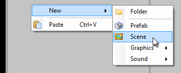
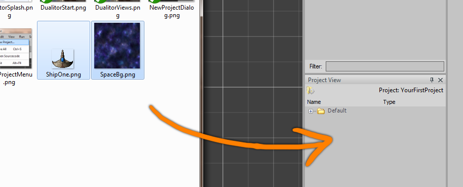

Whenever you need to store, modify or access game content, Resources are the way to go. There are a lot of different Resource types and each of them encapsules a different kind of data. This article is here to clarify some of the concepts behind Dualitys Resource system and show you how to use it most effectively.

# Overview

In Dualitys editing environment, the Project View is where you'll find all currently existing Resources. When starting a new project, it is typically empty and you'll fill it during development. Any kind of game content is stored as Resource file in Dualitys Data folder and is either created directly in the editor (Scene, Prefab, etc.) or imported from external source files (Pixmap, AudioData, etc.). You can easily create new Resources by right-clicking on an empty spot in the Project View and selecting the appropriate entry from the New menu. 



Of course, those Resources will be more or less empty. While some Resource types are perfectly editable using the Object Inspector, others might need to be edited using external programs. To open a Resource for editing, simply double-click it. This will extract its data to the Source/Media directory and then open it with the respective file formats default application. Duality will keep an eye on those files - as soon as you edit and save them, it will automatically reload their associated Resources and you can directly see your changes inside the editor.


Instead of creating game content in Duality, you can also import Resources from external source files: Simply dragdrop them onto the Project View. Not all image, sound or font formats are supported, but .png, .ogg and .ttf should always work. When in doubt, just try it and see if Duality does something useful. The worst that could happen is an error message.



# Accessing Resources

After importing and setting up some Resources in your project, it is likely that you want to use them in some way. For small prototype projects, you might get away with dragging them around in the editor UI without ever having to access them yourself via source code: Want to assign a new Material to a SpriteRenderer? Just dragdrop the Material Resource to the Components SharedMaterial property. Most of the time, actions like this are sufficient. But what if you want to switch the current Scene, instantiate a Prefab or lookup some static data?

Basically, there are three ways of accessing Resources:

  * Request it from the ContentProvider. This will also load the Resource and make it directly available: 

```csharp
texRef = ContentProvider.RequestContent<Texture>(@"Data\Gfx\SomeObject.Texture.res");
```

  * Reference it directly. This will load the Resource as soon as it is accessed:

```csharp
texRef = new ContentRef<Texture>(null, @"Data\Gfx\SomeObject.Texture.res");
```

  * Provide a public ContentRef property in your custom Component or Resource. When selecting an object of the appropriate type in the editor, you can dragdrop a matching Resource into the property editor to establish a reference.

```csharp
private ContentRef<Texture> myTex = null;
public ContentRef<Texture> MyTexture
{
    get { return this.myTex; }
    set { this.myTex = value; }
}
```

  * Default Resources (i.e. the ones that are embedded directly in the Duality binaries) can be accessed using static methods on their respective class: 

```csharp
texRef = Texture.Checkerboard256;
```

You will notice that the type you're dealing with isn't a Resource object but rather a `ContentRef<Resource>` or `IContentRef`. Its purpose is to reference Resources in an abstract way based on their actual path. It is an indirection layer that simplifies dealing with certain use cases: While actual Resources may be unavailable, not-yet-loaded, disposed or disposed-and-then-reloaded, their ContentRefs always remain comparable and reliable. You can think of it as a smart reference that knows what it _should_ contain and takes care of actually doing so. _Find more information about the design choices behind `ContentRef<T>` [here](http://www.adamslair.net/blog/?p=1037) if you're interested._

A ContentRef is able to provide some basic information about its content without actually loading the associated Resource. Other than that, it does its best to assist without getting in the way. The following example is an overview of how to use them:

```csharp
    // Access a Resource
    ContentRef<Pixmap> pixmapRef = GameRes.Data.Gfx.SomeObject_Pixmap;
    Pixmap pixmap = pixmapRef.Res;
    
    Console.WriteLine(pixmapRef);                    // [L] Pixmap "Data\Gfx\SomeObject"
    Console.WriteLine(pixmap);                       // Pixmap "Data\Gfx\SomeObject"
    
    
    // Reference type casting
    pixmapRef = pixmap;                              // Implicit to ContentRef
    pixmap = (Pixmap)pixmapRef;                      // Explicit from ContentRef
    
    Console.WriteLine(pixmapRef);                    // [L] Pixmap "Data\Gfx\SomeObject"
    Console.WriteLine(pixmap);                       // Pixmap "Data\Gfx\SomeObject"
    
    
    // Resource type casting
    ContentRef<Resource> resRef = pixmapRef.As<Resource>();
    ContentRef<Sound> soundRef = resRef.As<Sound>();
    
    Console.WriteLine(resRef);                       // [L] Pixmap "Data\Gfx\SomeObject"
    Console.WriteLine(soundRef);                     // [N] Resource "null"
    Console.WriteLine(resRef.Is<Pixmap>());          // True
    Console.WriteLine(resRef.Is<Sound>());           // False
    
    
    // Equality checking
    ContentRef<Pixmap> pixmapRef2 = Pixmap.Checkerboard256;
    Console.WriteLine(pixmapRef == pixmapRef2);      // False
    Console.WriteLine(pixmapRef == pixmap);          // True
    Console.WriteLine(soundRef != null);             // False
    
    
    // Properties that don't trigger loading
    Console.WriteLine(pixmapRef.Path);               // Data\Gfx\SomeObject.Pixmap.res
    Console.WriteLine(pixmapRef.FullName);           // Data\Gfx\SomeObject
    Console.WriteLine(pixmapRef.Name);               // SomeObject
    Console.WriteLine(pixmapRef.ResType);            // Duality.Resources.Pixmap
    Console.WriteLine(pixmapRef.IsExplicitNull);     // False
    Console.WriteLine(pixmapRef.IsLoaded);           // True
    Console.WriteLine(pixmapRef.IsDefaultContent);   // False
    Console.WriteLine(pixmapRef.IsRuntimeResource);  // False
    
    
    // Properties that do trigger loading
    Console.WriteLine(pixmapRef.IsAvailable);        // True
    Console.WriteLine(pixmapRef.Res);                // Pixmap "Data\Gfx\SomeObject"
    
    
    // Interface class
    IContentRef resRefInterface = resRef;
    // ... access properties, Is, As, etc.
```

# Custom Resources

In some cases, you might want to have your own kind of static or global data: Game rules, blueprints, shared states, whatever your specific game needs to store in or read from files. Long story short, here's how it works:

```csharp    
    public class YourCustomResource : Resource
    {
        private float someFloatValue = 1.0f;
    
        /// <summary>
        /// [GET / SET] A float value that encodes some kind of information.
        /// </summary>
        public float SomeFloatValue
        {
            get { return this.someFloatValue; }
            set { this.someFloatValue = value; }
        }
    }
```

It's quite easy. Just derive from the Resource base class and implement as needed. You will be able to create, configure and use your custom Resource type in the editor just like all the other Resources. For a quick test, right-click in the Project View and select New / YourProjectNamespace / YourCustomResource.

# Best Practices

On referencing Resources:

  * Fields should always use `ContentRef<T>` instead of `T`.
  * Non-private Properties should always use `ContentRef<T>` instead of `T`.
  * Non-private Methods should always use `ContentRef<T>` instead of `T` in both parameters and return value.
  * You may safely hold direct references locally. However, do not store it anywhere except local variables.

```csharp
    protected void SomeMethod(ContentRef<Pixmap> somePixmapRef)
    {
        Pixmap directRef = somePixmapRef.Res;
        if (directRef == null) return;
    
        directRef.DoSomething();
        directRef.DoSomethingElse();
        directRef.DoSomethingReallyUseful();
    }
```

  * Accessing `Res` is very cheap - except when the Resource hasn't been loaded before and loading is triggered on-demand. To manually trigger loading, use `MakeAvailable()`.
  * Always assume that content may be unavailable and `Res` might return null.
  
On other topics:

  * Resources should always be fully contained within Dualitys content management system. This means:
    * Don't load external data on construction or initialization of a Resource. Instead, this data should be contained within the Resource itself or another Resource that is referenced via `ContentRef<T>`.
    * Don't refer to external file or directory paths in general.
    * Refer to other Resources only using `ContentRef<T>`. Don't refer to them using a string path.
  * As Resources are serialized individually, they can't reference objects that are stored in different Resources. This also means that you shouldn't reference GameObjects, Components or anything else that is part of a Scene from within a custom Resource.
  * Flag non-persistent / temporary fields with the `[DontSerialize]` attribute.