This short article will give you a quick intro to using Tilemaps in Duality. It is assumed that you already know the basics. If not, head over to the [Getting Started](getting-started.md) tutorial first!

# Installation

Tilemaps are great for a lot of reasons, but as neat as they are, not every game needs them and we don't want to clutter everyone's workspace with a feature that only some select people will use. That's why tilemaps are not part of the Duality core, but implemented in a plugin that you can install. As with most plugins, there are two ways to get them.

## Via Package Manager

This is certainly the easiest way and recommended for basically everyone. Open up the Package Manager by clicking the `File / Manage Packages...` menu item, switch the View to `Online Repository` and select the `Tilemaps (Editor)` package, which will install `Tilemaps (Core)` as a dependency as well. Click the `Install` button in the lower right of the dialog, wait for the progress bar to finish and hit `Apply` afterwards. The editor will restart and you will now have tilemaps at your disposal.

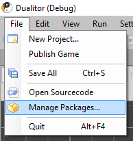

You might have noticed that **there is also a `Tilemaps Sample` package**. Feel free to install it and take a look to get a preview on one of the potential tilemap setups! If you are a new user, please make sure to uninstall the sample again before proceeding with this tutorial so we have a clean slate to start with.

## Via source code

Of course, you can also clone the Duality repository and build everything yourself. This tutorial does not cover how to do a full Duality build, but it's really just opening up `Duality.sln` and hitting `Rebuild Solution` in Visual Studio. If you do not have an existing project somewhere and just want to do a quick test session, you can directly set the `DualityEditor` project as a startup project, and then select "Start without Debugging" from the menu - or hit `Ctrl+F5`. 

If you do have a separate project you want to test the plugin with, instead just copy the resulting `.dll` and `.xml` files into your game projects `Plugins` folder before firing up the editor. You should find the files in question here:

```
DualityPlugins/Tilemaps/bin/TheBuildConfigYouSelected/
DualityEditorPlugins/Tilemaps/bin/TheBuildConfigYouSelected/
```

# Tilemap Setup

For our tutorial, we first need a tileset to start with. Our goal will be to set up a layered tilemap with [Oblique Projection](https://en.wikipedia.org/wiki/Axonometric_projection), i.e. the one you know from retro RPGs and the typical "Rpg Maker" game. Here's a [CC0 tileset from OpenGameArt](http://opengameart.org/content/mage-city-arcanos) (© Hyptosis, 2012) that we will use as an example for this tutorial. Just download the PNG file and import it as a Pixmap:

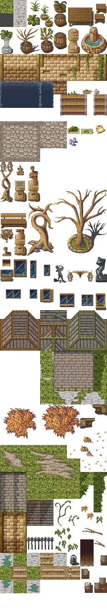

Okay, so you're all set and ready to go. Let's do this!

## Creating a single Tilemap

Before we do the more complex layered tilemap setup, you should get an idea of what will be happening behind the scenes. 

In the previous step, you imported the source image that we will use as a Pixmap resource. As you know, a Pixmap is a way of storing and managing pixel data, and it can serve as the backing data for Texture and Material resources, which will then show up in the world when - for example - a SpriteRenderer uses them. If you dragdrop the Pixmap into your Scene View or Scene Editor, this is exactly what happens: The editor will create a Texture and Material resource, as well as a SpriteRenderer, and you will see it floating in space.

[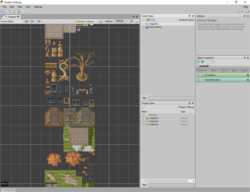](../img/Tilemaps/TilesetSprite.png)

That's not what we want though, is it? So let's delete the automatically created SpriteRenderer object, Texture and Material resources again. They will not be required for this. Instead, right-click the Pixmap resource and select `Create Tileset` from the context menu. You can double-click the newly created Tileset resource to open up the Tileset Editor, but we'll get to that later. 

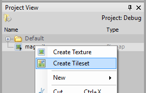

For now, just dragdrop the Tileset resource into the Scene View or Scene Editor, just like you did before with the Pixmap resource. What you will see if you zoom out a little should be something like this:

[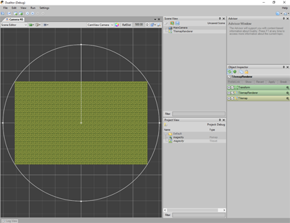](../img/Tilemaps/CreateSingleLayerTilemap.png)

The editor created a simple tilemap object for you, complete with Transform, Tilemap and TilemapRenderer components. While the Tilemap component itself is merely a data container for your map, the Transform component anchors it inside the game world and the TilemapRenderer will use that as a base position for rendering whatever the Tilemap component stores. What you see is a rendering of a default size tilemap that was filled with the first non-empty tile the editor was able to discern.

You could now start to edit this, but bear with me for a moment: We're not quite there yet. Before continuing, delete the TilemapRenderer object again, so we won't confuse it with what follows.

## Creating a layered Tilemap setup

A single tilemap is a nice start, but usually won't be sufficient. The grass surface you're seeing is a nice background, but what if you wanted to put a lamp post on top of that? A single tile can only be filled with one chunk from the tileset, so it could be grass, stone, a wall, or something else - but not a barrel _on top of_ grass, since that would imply two chunks of the tileset being used at once. To counter this, we will set up multiple tilemap layers on top of each other, so the lowermost could be grass and the one on top of that could be a barrel.

The Scene Editor and Scene View only operate on a very general premise, which is that you're working with GameObjects and Components. When you drag a Tileset resource in there, they will try their best to create such an object from it, while doing minimal work in the process. For the more advanced stuff, switch your Camera View state from `Scene Editor` to `Tilemap Editor`. Unlike the Scene Editor, it knows that you're in for some serious tilemap editing and will provide you with the tools you need.

[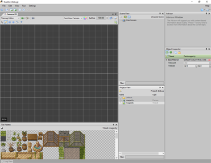](../img/Tilemaps/TilemapEditor.png)

After the switch, two things will have appeared: A new toolbar at the top of the Camera View (which contains all the editing tools for tilemaps) and the Tile Palette module (which you can dock somewhere that fits your screen size and layout). We'll get to them in a second, but let's create some layered tilemaps first. Drag the Tileset resource (or Pixmap resource, actually) from your Project View into the Tilemap Editor. The following dialog should appear:

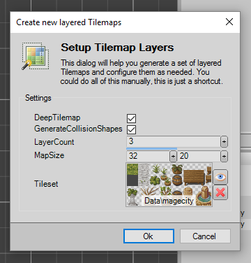

Hovering over each parameter will display an explanation in the Advisor module. For now, leave all the values as they are and click `Ok`. The editor will now create a layered tilemap setup that should look like this:

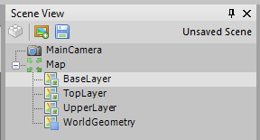

The root object `Map` acts as a passive parent object, which you can use (in the Scene Editor) to move around the map as a whole. Among its child objects, there is one tilemap / renderer combo per layer you specified (`BaseLayer`, `UpperLayer` and `TopLayer`), as well as one shared `WorldGeometry` object that contains a RigidBody and TilemapCollider component. Those last two are responsible for physical interaction with other objects: While the RigidBody just behaves like any other (static) RigidBody, the TilemapCollider uses the information from all the tilemap layers to automatically supply the RigidBody with the shapes you'd otherwise have to create manually. It also keeps track of which shapes were auto-generated, so you can actually add your own shapes to the RigidBody and they will be kept around as usual.

# Editing Tilemaps

Time for some tilemap editing. In the Tile Palette, click-drag to select a rectangular region of tiles for painting, or just a single tile like so:

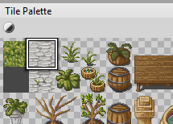

And then just use your mouse to paint some tiles in the Tilemap Editor. The default tool is the Tile Brush, which will serve just fine for this. If you haven't selected a Tilemap, you might need to click twice - the first click will select the hovered tilemap and the second one will actually start editing. If you want to switch the tilemap you're editing later, you can either select it in the Scene View, or use the `Up` and `Down` arrow keys directly in the Tilemap Editor.

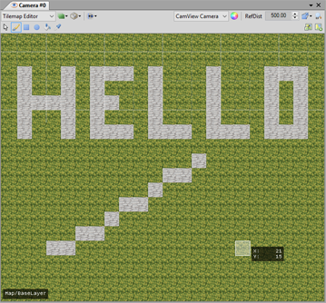

If you select more than a 1x1 region in the Tile Palette, the brush will mimic the pattern that is selected. This also works for all the other tools.

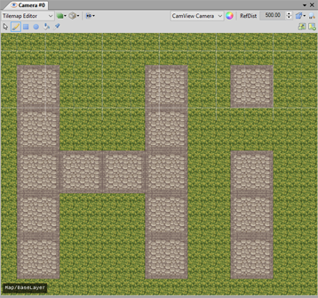

If you want to copy an existing region from the map to a different spot, hold the `Alt` key and (click-drag) select a rectangular region to copy from. As with the patterns, this works for all the other tools as well.

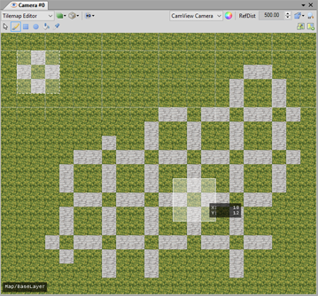

Speaking of other tools, you will also find `Draw Rect`, `Draw Oval` and `Flood Fill` in the toolbar, but they likely require no further explanation. For an optimal workflow, keep in mind that all of those tools have a keyboard shortcut which you can use while editing tilemaps.

# Intermission: Deep Tilemaps and a very basic ActorRenderer

Now that you've set up layered tilemaps and are ready to edit them, there is one thing that you should know about what's going on behind the scenes, or more specifically: How depth is handled when rendering tilemaps.

When you set up the multi-layered tilemaps earlier using the dialog, one of the options let you choose between creating flat or deep tilemaps. The first ones, **flat tilemaps**, are really straight-forward: A sprite (or any renderer, really) can either be in front of or behind the tilemap and that's it. These tilemaps are ideal for games with a side or top-down perspective where each tilemap represents a flat area and it's really the easiest situation to deal with. It gets more complicated when you do an Oblique / Retro RPG like perspective, where the player character can walk either in front of or behind the same tree - and that's what deep tilemaps are there for.

Unlike flat tilemaps, where every tile shares the same depth value as all the other tiles, a **deep tilemap** will assign a custom depth value to each tile vertex. Tiles at the top now have higher depth values than tiles at the bottom and there also is a difference between floor tiles (where the depth gradually increases from bottom to top) and vertical / wall tiles (where the entire tile uses its lower depth value). On top of that, each tile can now have a distinct height value to indicate whether a tile is at the ground level, below or above it.

By default, all tiles in a deep tilemap are considered floor tiles (i.e. non-vertical) and without height offset. When you drop in a regular SpriteRenderer, it will look like this:

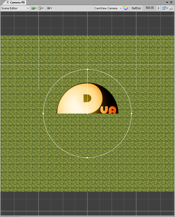

Since the tilemap now essentially starts "in the distance" at the top and gradually "comes nearer" towards the bottom, it is neither in front of nor behind the SpriteRenderer, which, as you move it around in XY, _appears_ to change its X position and "height above ground" while being fixed at the same distance. Also note how you can adjust its `ZOffset` value to change the spot at which it intersects the tilemap - it now represents the spot where the sprite is "standing on" the tilemap.

If you want a character to walk around on a deep tilemap, this way of depth interaction is exactly what we need, as we can now adjust how "far away" the character currently is with regard to a tree or wall or building roof that you painted on the tilemap. There are two ways to make full use of this behavior:

1. **Create a custom updater** Component that will adjust the sprites depth offset value according to its Y value.
2. **Implement a custom renderer** Component that does the same thing internally, so you don't have to bother anymore and can treat it as a blackbox.

Option #2 is the one that I'd advise for projects using deep tilemaps if you're planning for them to be bigger than a game jam entry or similar. To get a good idea on how to implement one, take a look at the [ActorRenderer](/AdamsLair/duality/blob/master/Source/Plugins/Tilemaps/Sample/RpgLike/ActorRenderer.cs) from the Tilemaps Sample package. You can also use it directly, though you might need or want to adjust the code to fit your project.

# Editing Tilesets

When it comes to actually using tilemaps rather than just displaying them, there is no way around specifying some additional info in the Tileset Editor. Double-click the Tileset resource you've created in order to open it. In the new editor module, you will find three things you can adjust, divided into three tabs:

* **Visual Layers** are where you specify how the source image from your Pixmap resource is interpreted and what transformation steps will be performed when initializing the tileset from it. When you're using a tileset with a different size than 32x32 for example, you will need to adjust the source tile size here, as well as the TileSize property of the Tileset resource itself. A single tileset can have multiple visual layers and each of them will be available to the renderer in a distinct texture channel. For a plain standard tileset, you don't usually need to bother with this.

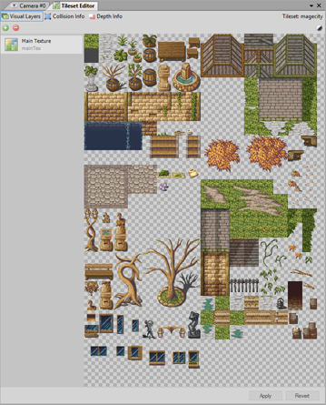

* **Collision Info** is where you specify which tiles are blocking movement and which are passable. There are multiple collision layers that can provide different values, which can be useful when you want to specify different collision behavior for walking, swimming and flying things. As long as you don't need this, you can just ignore the additional layers though - the default TilemapCollider configuration will only evaluate the first collision layer.

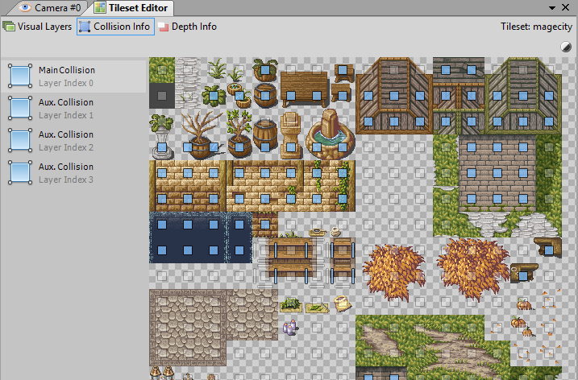

* **Depth Info** allows you to specify a height offset for each tile, as well as whether a tile should be considered vertical (wall) or flat (ground). If you're not using a deep tilemap, you can safely ignore this tab altogether.

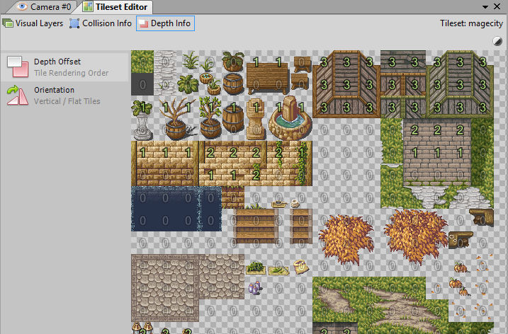

Note that editing a Tileset will require it to recompile in order to apply all the changes. Don't forget to hit the `Apply` button after editing!

# Advanced: Custom Tools, Actions, Tilemap Renderers

ToDo

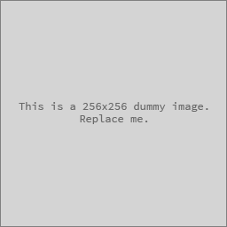