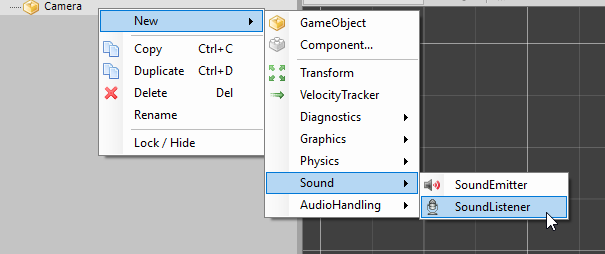
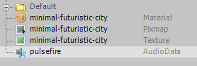
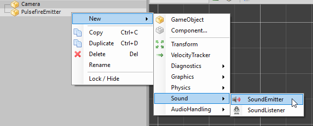
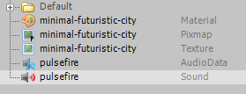

Visuals are just half of what makes a game. Audio is the other half that completes the experience. Audio gives feedback to the player, adds to the immersion of the game and helps ground visuals. In this article we will take a look at how audio handling works in Duality.

# Audio terminology

Before we dive in let's take a step back and go through some of the terminology that is commonly used in game audio and game development in general. It's important for us to have a decent understanding of these concepts before moving onto other topics in the article.

## Sound Listener

A Sound Listener listens for oncoming sounds and acts as the "ears" of the player. It is what makes 3D audio in games possible. Duality provides a SoundListener component which we can attach to a game object, typically the Camera to act as the reference point for 3D audio.

## Sound Emitters

A Sound Emitter is a component that enables a game object to emit sound. These sounds will then be picked up by our Sound Listener and the respective 3D audio settings will be applied. That is, sounds emitting from the left side of the listener will be panned to the left speaker and sounds emitting from the right side will be panned to the right speaker, creating the effect of 3D audio. Duality provides a SoundEmitter component which can be attached to a game object to have that object emit sound.

## 2D Sounds vs 3D Sounds

The distinction between 2D sounds and 3D sounds can be confusing to a lot of people at first, so let's clarify that next. A 3D sound is a sound instance that is attached to an object in the game world. For example, this could be a character in the game. When the character moves forward, a footstep sound could be emitted. This footstep sound is attached to the character and therefore it is emitted from the character's position and has a presence in the game world. A 2D sound on the other hand is a sound instance that is not attached to a game object in the world. A good example for a 2D sound would be background music. Background music essentially plays out of nowhere (ie. in the background).

# Setting up the Sound Listener

Before playing sounds we must first correctly set up the Sound Listener in our scene. A Sound Listener can be attached to any game object and that game object will then act as the reference point for 3D audio. Typically it is attached to the Camera.

Right click on your camera, select New, select Sound and click on the SoundListener component.



The SoundListener will now be attached to our camera and act as the reference point for 3D audio!

# Playing sounds

Now that we have the listener set up it's time to play some sounds!

## Playing a simple sound

Let's now play a simple sound using Duality's SoundEmitter component. If you read through the previous topics you should now have a good understanding of how the SoundEmitter relates to the SoundListener.

Drag any sound file to your project view. The sound file has to be in .ogg format. For 3D audio to kick in it must also be a mono sound file. Upon dragging in the sound file the Duality editor will create a new AudioData resource file for us. In this case my sound file was called "pulsefire".



Create a new game object (or use an existing game object) that wishes to emit sound. Add a new SoundEmitter component to the object.



Drag the AudioData resource file into the SoundEmitter component in the object inspector. Your SoundEmitter component will look like this (in this case "pulsefire" is the filename of the sound I used. It will be different in your case.).


Also, if you take a look at the project view you will notice that the Duality editor has created a Sound resource out of the AudioData resource we provided.



Now, when you run your game the sound should start playing and when you move your game object around the listener it should pan accordingly between the left and right speakers. Once again, your sound file must be in mono for 3D audio to work!

## Playing ambience sounds

Ambience sounds such as wind or rain usually must not be attached to a single game object in the world because it is meant to be a 2D sound (ie. plays in the background). You could always try to simulate it through point emitters but that would be way too overkill for most games. So in this case, we can simply attach a SoundEmitter component directly to the camera (to which the SoundListener is attached to). As both the emitter and the listener have the same position at any given time the sound will effectively be treated as a 2D sound with no presence in the game world.

## Playing music

So far we have only worked with the editor to play sounds so let's jump into some code. A good demonstration of this would be playing background music which typically requires some manual work by the programmer such as fading in/out music in a way that is reactive to the game state and applying various effects.

Here's how you'd play some background music:

```csharp
// Declare fields in some Component class
private ContentRef<Sound> sound = null;
private SoundInstance instance = null;
```

```csharp
private void StartAudio()
{
	// Grab a reference to the Sound resource (our music loop)
	this.sound = ContentProvider.RequestContent<Sound>(@"Data\MusicLoop.Sound.Res");
	
	// Start playing
	this.instance = DualityApp.Sound.PlaySound(this.sound);
	
	// Set the Looped property to true as we want the music to loop
	this.instance.Looped = true;
}
```

### Fading in and out

Starting and stopping music immediately with no fading can be quite abrupt and often distract the player which ultimately leads to a poor overall player experience. To help with this we can smooth out transitions with a simple fade out or a fade in. Duality provides helper methods that allows you to do this quite effortlessly.

```csharp
// start the ambience music
// ambience music plays regardless of which state the player is in
this.ambienceLoop.BeginFadeIn(5.0f);
```

```csharp
// The player is in combat: Fade out the Exploration music and fade in the Combat music
if (Player.IsInCombat())
{
	this.ambienceLoop.FadeOut(5.0f);
	this.combatLoop.FadeIn(5.0f);
}
// The player is not in combat: Fade out the Combat music and fade in the Exploration music
else
{
	// The player is not in combat: Fade out the Combat music and fade in the Exploration music
	this.combatLoop.FadeOut(5.0f);
	this.ambienceLoop.FadeIn(5.0f);
}
```

In this example `ambienceLoop` and `combatLoop` are SoundInstance objects and we call the `BeginFadeIn`, `FadeIn` and `FadeOut` helper methods with a fade time of 5 seconds.

# Applying audio effects

Effects are another way to make your game's audio feel more dynamic and reactive. Duality offers some standard audio effects straight out of the box. Additional effects can also be accessed through the audio backend.

## Low pass filter

You can think of a low pass filter as essentially "audio blur". It can be used in many ways to enhance the player experience (eg. drown out the audio to signal to the player that they are low on health).

```csharp
// Change the low pass factor. Lower values cut off more frequencies
this.soundInstance.Lowpass = 0.5f;
```

## Pitch shift

Changing the pitch can be useful for slow-mo effects!

```csharp
// Change the pitch factor
this.soundInstance.Pitch = 1.0f;
```
