There are two kinds of logs in Duality: Text logs and visual logs. While text logs are essentially just a series of text messages written by various parts of engine and game, visual logs allow displaying game states in the game world, in realtime. Both have their use cases and specialize to achieve different goals.

# Text Logs

Besides attaching a debugger and stepping through code in real time, good old text logs are probably the most important way to find out what's wrong with an application. Duality itself relies heavily on logfiles, both to provide insight into bugs, but also to inform about problems with game code and plugins.

## Viewing

Logs are stored and displayed differently when written from a game instance or the editor.

### Editor View

When anything unexpected happens and game code crashes, the Duality editor is usually the first to notice. The `Log View` is where you can read all messages, warnings and errors that were written by core, game, editor and plugins. It is generally useful to keep an eye on it, especially while working on game code or testing new features.

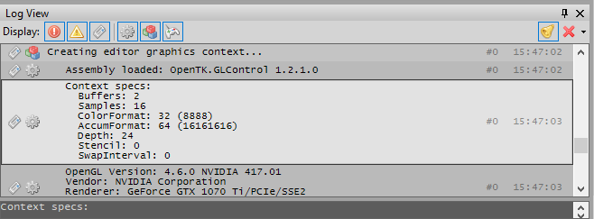

The log view will by default display all logs, but can be configured to filter by log channel and message type. Right-clicking a message allows to copy it individually, or in context with the other messages, and the view can be cleared manually or whenever the game is started inside the editor.

By default, the Log View is docked as a foldout tab on the bottom of the main layout, but can be rearranged as needed. When closed, a new Log View can be opened using the `View / Logs` menu item.

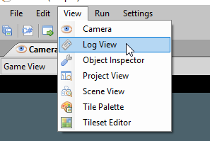

### Logfiles

Logfiles are located next to the game and editor executable.

- When running the game, `logfile.txt` will be used.
- When running the editor, `logfile_editor.txt` will be used.
- For diagnostic purposes, the editor will archive previous logs in the `Temp` subfolder.

If the preferred logfile location is not writable, or creating / overwriting the intended logfile fails for some reason, Duality will continue without a logfile. If any other log outputs besides the default files are available, an error will be logged.

While each game can choose its own log format, or change how logs are written overall, the default choice is a regular text file that can be opened with any text editor.

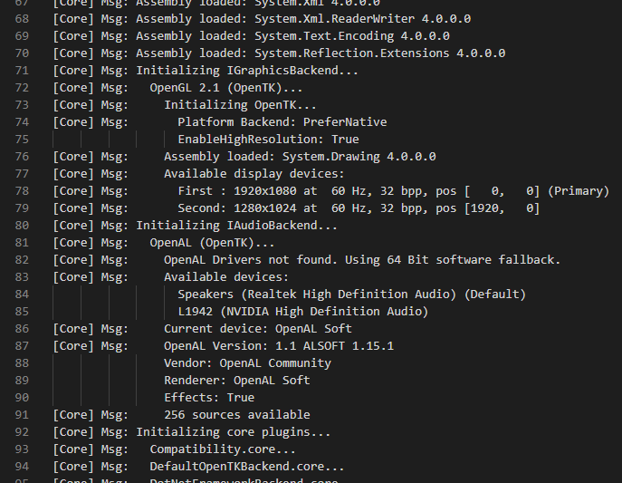

### Console Window

The default game launcher also supports a live view of logs on an optional console window. To enable it, either run the launcher from the editor, or provide `editor` as an additional command line argument to achieve the same effect.

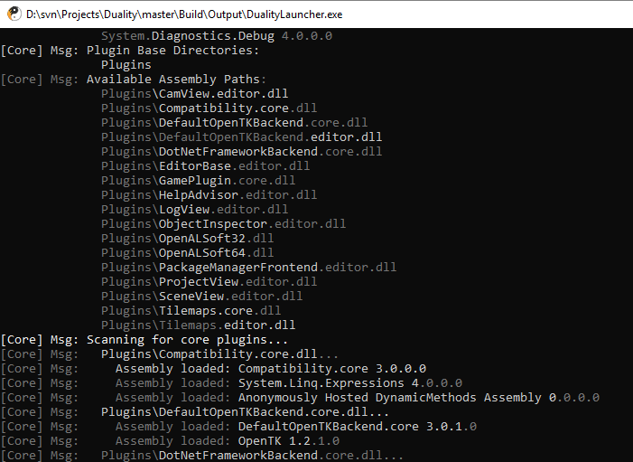

Console colors will be used to highlight warnings and errors, as well as to grey out repetitions over multiple lines, focusing on new information instead.

## Writing

Writing a log entry can be done anywhere in your code, whenever needed. It might look like this:

```csharp
Logs.Game.Write("Hello World");
```

The main use of writing log entries is to allow you to make sense of what's happening when something goes wrong. When your game does something unexpected, seeing a log entry will tell you that "Yes, this code was executed", and multiple entries inform you about the order in which certain things happened. Sometimes that's already enough to give you a hint on what's wrong. Other times, you might need more information, like in this case:

```csharp
Logs.Game.Write(
	"The game window is {0} pixels wide and {1} pixels high.", 
	DualityApp.WindowSize.X,
	DualityApp.WindowSize.Y);
```

Here, we're using a formatted string to provide additional information about the state of the game and application at the time the log entry is written.

Log entries usually deal with distinct events, not continuous changes: It makes sense to write an entry when entering levels, applying settings, spawning objects, reaching goals - things that do not happen all the time. If a game was to log the position of the player object every frame, it would only end up flooding the logfile with useless information and make it harder to read and interpret. There may be situations where it can make sense to do just that, because there is a bug that happens to mess with the player position every few frames in some way; but these kinds of logs are usually removed from game code again after the bug is fixed.

### Message Types

Not all logged events are equal - some are more severe than others. Duality logs distinguish between three types of log messages:

- **Messages** inform about a regular and expected event without any indication of a problem. Message logs exist to set the stage and provide context for other, more significant logs - or indicate a problem through their unexpected absence.
  > :newspaper: There is a glass of milk on the table.
- **Warnings** note that something might be off, even though this may not necessarily be a problem. Warning logs often become significant in retrospect, once something else went wrong down the line that can now be traced back to a previous warning. 
  > :warning: The glass of milk was pushed (by X).
- **Errors** indicate that something is definitely wrong, and while it may or may not be possible to recover from the incident, it simply shouldn't have happened in the first place. The presence of an error entry in the log often indicates that there is something to be fixed.
  > :heavy_exclamation_mark: There is milk spilled across the floor.

API-wise, there are different methods for writing messages of the various types. Their usage is equivalent though:

```csharp
Logs.Game.Write("Hello {0} Message", foo);
Logs.Game.WriteWarning("Hello {0} Warning", foo);
Logs.Game.WriteError("Hello {0} Error", foo);
```

Note that Duality will automatically write an error log when encountering an unhandled exception - so you should usually find an error as the last entry of the logfile after experiencing a game or editor crash.

### Indentation

Some log entries are written as part of a bigger, ongoing operation: Loading scene X might trigger loading materials A and B, which in turn load textures C, D and E. To make it easier to see these relations in a logfile, Duality logs provide a shared API for controlling indentation. Let's expand the example above with some code and produced log output:

```csharp
Logs.Game.Write("Loading resource {0}...", resource);
Logs.Game.PushIndent(); // Go down one indentation level

// Do complex loading stuff, might trigger loading more resources

Logs.Game.PopIndent(); // Go back up
```

Given the above setup, our example could produce the following output:

```
Loading resource X...
	Loading resource A...
		Loading resource C...
		Loading resource D...
	Loading resource B...
		Loading resource E...
```

With the indentation in place, we're able to clearly see how the sequence of loading events is structured, and how each load was triggered. It's similar to examining a callstack during a debug session, but on a much broader scope and less connected to implementation details.

### Formatting

Duality provides some utility methods for getting string representations of common diagnostic types, which can be found in the static `LogFormat` class.

```csharp
Logs.Game.Write("I'm currently in {0}", LogFormat.CurrentMethod());
```
```csharp
Type someType = something.GetType();
Logs.Game.Write("I'm dealing with a {0}", LogFormat.Type(someType));
```
```csharp
try
{
	// ...
}
catch (Exception e)
{
	Logs.Game.Write("Something went wrong: {0}", LogFormat.Exception(e));
}
```

### Thread Safety

All text log API in Duality is thread safe, so you can write text logs from whichever thread you like without additional locking mechanisms.

## Customizing

Duality provides two ways in which text logs can be customized: By providing more channels to write into, and by attaching more output targets for processing the written log messages.

### Channels

Duality distinguishes between different channels when writing logs. Each channel can have a distinct set of output targets, can be filtered individually in the editor view, and is identified in text logs as well. There are three builtin channels: `Logs.Core`, `Logs.Editor` and `Logs.Game`. While it is possible for your code to write into each of them, only the `Game` channel is intended for log entried made by game code, whereas `Core` and `Editor` are written by Duality internals.

For bigger projects and custom or third party plugins, it can be a good thing to custom log channels to keep the overall output readable and well structured. Custom log channels are defined by deriving a new type from the `CustomLogInfo` base class and specifying the channels parameters accordingly:

```csharp
// Optional attribute for specifying a channel icon
[EditorHintImage("TestProject.EmbeddedResources.FooLog.png")]
public class FooLog : CustomLogInfo
{
	// Empty constructor, initializes base class with name and ID for this log
	public FooLog() : base("Foo Log", "Foo") { }
}
```

An icon for the above example would be located in the (game / core) plugins `EmbeddedResources` folder and configured to use the "Embedded Resource" build action:

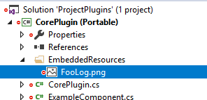
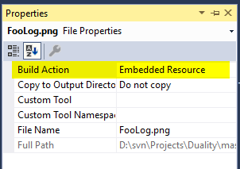

The custom log info class itself only serves as an identifier and configurator for the new log channel, while the channel itself will be maintained by Duality. In order to write into the new channel, the `Logs.Get<T>` method is used:

```csharp
Logs.Get<FooLog>().Write("Hello, World!");
Logs.Get<FooLog>().Write("It is {0}", DateTime.Now);
```

Note that the log channel `Get` method is almost as fast as a direct variable access, so it's completely fine to retrieve it on every write without storing it somewhere. Taking advantage of the channel-specific type definition, it internally uses a generic class to generate a type-specific static lookup without the need for a dictionary.

In the editor view, the new log channel will show up with its icon and name, and can be filtered just like any of the builtin log channels:

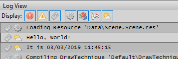

### Outputs

While log channels provide a public surface to write log messages, they do not decide where those messages end up in the end - logfile, console, editor view, or something else entirely. Different channels may have different outputs, and there is a global output list that is shared among all channels equally. The default log outputs are managed by core and editor, but games, plugins and launchers are free to register custom output handlers as needed.

```csharp
// Prepare a new log output that writes into a text file stream
StreamWriter writer = new StreamWriter("SpecialLogfile.txt");
writer.AutoFlush = true;
TextWriterLogOutput mySpecialLogFile = new TextWriterLogOutput(writer);
```
```csharp
// Register the new log output globally across all channels
Logs.AddGlobalOutput(mySpecialLogFile);
```
```csharp
// Register the new log output in the Game channel only, but none of the others
Logs.Game.AddOutput(mySpecialLogFile);
```

Besides the builtin `TextWriterLogOutput` and some internal writers for console and editor view, it is also possible to implement custom log outputs to achieve more tech-specific goals. Besides writing text files, you could also write binary or rich text logs, send the logs to some server, a team chat, or any other destination that makes sense for your setup.

```csharp
public class YourCustomLogOutput : ILogOutput
{
	public void Write(LogEntry entry, object context, Log source)
	{
		// Process a single log entry
	}
	public void PushIndent()
	{
		// Increase indentation for all following log entries
	}
	public void PopIndent()
	{
		// Decrease indentation for all following log entries
	}
}
```

Note that the `ILogOutput` API will be called from any thread that logs a message, and it's the responsibility of your implementation to deal with that.

# Visual Logs

Visual logs are designed for displaying object state and interaction in realtime, directly in the game world. While a text log is fine for documenting a sequence of events, having a direct visual representation can be infinitely more useful for things like movement vectors, pathfinding logic, AI states, object interaction, spatial queries and so on.

## Viewing

Given their nature of integrating directly into world rendering, there is no specific, separate view for visual logs and no destination where they're written. Instead, they appear just next to all the regular sprites and objects, as if they were part of the world themselves.

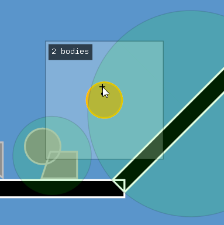

In the image above, visual logs are used to display physics queries in the game world right where they happen. Compare this to text logs where you'd first need to figure out which object is "Foo" and which is "Bar" and what a position of `(2532.48, -294.74)` means!

When using visual logs, one thing that should be considered is that they only work in game mode, but not in the editor. They are not intended to be editor gizmos and should not be used as such. They are also not intended to be used as part of actual game rendering, as their appearance is considered an implementation detail that could change at any time, as long as they still convey the information they were designed to visualize.

## Writing

Writing a visual log entry is very similar to writing a text log entry: There's a static class to access a log channel, and that log channel provides API for adding new entries. Unlike text logs, visual log entries do not have a distinction between messages, warnings and errors, but instead differ in appearance.

```csharp
// Hello World
VisualLogs.Default.DrawCircle(Vector3.Zero, 30.0f);
VisualLogs.Default.DrawPoint(100.0f, 0.0f, 0.0f);
```

The above line would draw a circle with radius 30 at world space position `(0, 0, 0)` a point at `(100, 0, 0)`. Both would be displayed for exactly one simulation frame, allowing to easily use visual logs as part of regular `OnUpdate` code: As long as a certain log line executes every frame, it will remain visible - once it is no longer executed, it will vanish. Per-frame logs are ideal for quickly visualizing continuous state and calculation results, such as a physics raycast:



For logging singular events, visual logs can also extend their lifetime to any duration:

```csharp
// Hello World for 5 seconds
VisualLogs.Default.DrawCircle(Vector3.Zero, 30.0f).KeepAlive(5000.0f);
```

Log entries with an extended lifetime will slowly fade out until reaching its end. They're a good match for visualizing collisions and other singular events that do not happen frame after frame.



Besides world space entries, visual logs can also be rendered in screen space by simply choosing the equivalent `Draw` method overload that works with 2D coordinates. Using the anchor modifier, world space logs can be attached to specific objects as well.

```csharp
// Draw in world space
VisualLogs.Default.DrawCircle(Vector3.Zero, 30.0f);
// Draw in object space
VisualLogs.Default.DrawCircle(Vector3.Zero, 30.0f).AnchorAt(someGameObj);
// Draw in screen space
VisualLogs.Default.DrawCircle(Vector2.Zero, 30.0f);
```

### Modifiers

In addition to issuing draw commands to a visual log, it is also possible to modify how submitted items are displayed. In the previous examples, we've already seen two modifiers in action: `KeepAlive` and `AnchorAt`. There are additional modifiers for changing appearance and rendering parameters, as well as the shape of some specific visual log items. 

Modifiers are generally applied via fluent syntax (`.DoSomething().DoSomethingElse().AndSoOn()`) to allow easily changing the parameters of a log item without storing it in a local variable and thus prefering "one liner" handling for logging purposes. A full list of available modifiers is available via autocomplete on each submitted log item in your IDE, and it may vary based on the type of log item. To provide a rough overview on what's possible, these are some of the more common modifiers:

- **KeepAlive** extends the lifetime of the current item by a number of milliseconds, allowing to display single-shot / event items.
- **AnchorAt** attaches an item to a `GameObject`, moving it from world space into object space.
- **WithColor** applies a color tint to the item.
- **WithOffset** applies a depth offset to the item for controlling rendering order.
- **DontScale** configures an item rendered in world space to not apply perspective scaling based on distance to camera.

Custom modifiers can be added by implementing extension methods that operate on the appropriate `VisualLogEntry` types.

### Item Types

#### Point

Point items do not have a size and are displayed as small circles that do not scale depending on camera perspective and position.

```csharp
VisualLogs.Default.DrawPoint(0.0f, 0.0f, 0.0f);
VisualLogs.Default.DrawPoint(50.0f, 0.0f, 0.0f).WithColor(ColorRgba.Red);
VisualLogs.Default.DrawPoint(0.0f, 50.0f, 0.0f).WithColor(ColorRgba.Green);
VisualLogs.Default.DrawPoint(50.0f, 50.0f, 0.0f).WithColor(ColorRgba.Blue);
```

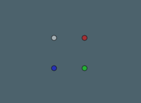

#### Vector

Vector items have a starting point, direction and length and are displayed as arrows. While their length and direction is displayed according to the cameras perspective, they are otherwise treated as zero-width entities and do not scale their arrows size when zooming in or out.

```csharp
VisualLogs.Default.DrawVector(new Vector3(0.0f, 0.0f, 0.0f), new Vector2(40.0f, 0.0f));
VisualLogs.Default.DrawVector(new Vector3(50.0f, 0.0f, 0.0f), new Vector2(0.0f, 40.0f)).WithColor(ColorRgba.Red);
VisualLogs.Default.DrawVector(new Vector3(50.0f, 50.0f, 0.0f), new Vector2(-40.0f, 0.0f)).WithColor(ColorRgba.Green);
VisualLogs.Default.DrawVector(new Vector3(0.0f, 50.0f, 0.0f), new Vector2(0.0f, -40.0f)).WithColor(ColorRgba.Blue);
```

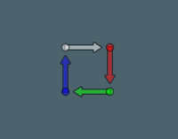

#### Connection

Connection items have a starting point and an end point. While their length and direction is displayed according to the cameras perspective, they are otherwise treated as zero-width entities and do not scale their size when zooming in or out.

```csharp
VisualLogs.Default.DrawConnection(new Vector3(0.0f, 0.0f, 0.0f), new Vector2(40.0f, 0.0f));
VisualLogs.Default.DrawConnection(new Vector3(50.0f, 0.0f, 0.0f), new Vector2(50.0f, 40.0f)).WithColor(ColorRgba.Red);
VisualLogs.Default.DrawConnection(new Vector3(50.0f, 50.0f, 0.0f), new Vector2(10.0f, 50.0f)).WithColor(ColorRgba.Green);
VisualLogs.Default.DrawConnection(new Vector3(0.0f, 50.0f, 0.0f), new Vector2(0.0f, 10.0f)).WithColor(ColorRgba.Blue);
```

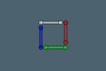

#### Circle

Circle items have a position and a radius, which is considered part of the displayed data and thus scales depending on camera perspective.

```csharp
VisualLogs.Default.DrawCircle(new Vector3(0.0f, 0.0f, 0.0f), 25.0f);
VisualLogs.Default.DrawCircle(new Vector3(50.0f, 0.0f, 0.0f), 25.0f).WithColor(ColorRgba.Red);
VisualLogs.Default.DrawCircle(new Vector3(50.0f, 50.0f, 0.0f), 25.0f).WithColor(ColorRgba.Green);
VisualLogs.Default.DrawCircle(new Vector3(0.0f, 50.0f, 0.0f), 25.0f).WithColor(ColorRgba.Blue);
```

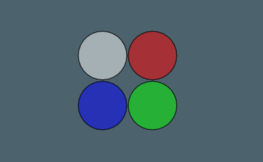

Using the optional `Segment` modifier, the displayed circle can be reduced to a specific angle range.

```csharp
VisualLogs.Default.DrawCircle(Vector3.Zero, 50.0f).WithColor(new ColorRgba(0, 0, 0, 64));
VisualLogs.Default.DrawCircle(Vector3.Zero, 50.0f).Segment(MathF.DegToRad(45.0f), MathF.DegToRad(135.0f));
```


#### Polygon

Polygon items have a position and a set of vertices forming a (convex) polygon. Both shape and size of the polygon are regarded as part of the displayed data, so they scale and transform depending on camera perspective.

```csharp
VisualLogs.Default.DrawPolygon(new Vector3(0.0f, 0.0f, 0.0f), new Vector2[]
{
	new Vector2(-20.0f, -20.0f),
	new Vector2(20.0f, -20.0f),
	new Vector2(20.0f, 20.0f),
	new Vector2(-20.0f, 20.0f)
});
VisualLogs.Default.DrawPolygon(new Vector3(50.0f, 0.0f, 0.0f), new Vector2[]
{
	new Vector2(-20.0f, -20.0f),
	new Vector2(20.0f, 20.0f),
	new Vector2(-20.0f, 20.0f)
}).WithColor(ColorRgba.Red);
VisualLogs.Default.DrawPolygon(new Vector3(50.0f, 50.0f, 0.0f), new Vector2[]
{
	new Vector2(-20.0f, -20.0f),
	new Vector2(20.0f, -20.0f),
	new Vector2(20.0f, 20.0f),
	new Vector2(-20.0f, 20.0f)
}).WithColor(ColorRgba.Green);
VisualLogs.Default.DrawPolygon(new Vector3(0.0f, 50.0f, 0.0f), new Vector2[]
{
	new Vector2(-20.0f, -20.0f),
	new Vector2(20.0f, -20.0f),
	new Vector2(20.0f, 20.0f)
}).WithColor(ColorRgba.Blue);
```

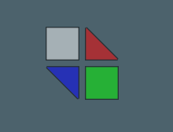

#### Text

Text items have a position and a text string. The displayed text has a constant scale regardless of camera perspective, and a background that depends on the text colors luminance value to ensure good readability. Alignment modifiers can be used to control which corner of the text is defined by the specified position.

```csharp
VisualLogs.Default.DrawText(0.0f, 0.0f, 0.0f, "First").Align(Alignment.Center);
VisualLogs.Default.DrawText(50.0f, 0.0f, 0.0f, "Second").Align(Alignment.Center).WithColor(ColorRgba.Red);
VisualLogs.Default.DrawText(50.0f, 50.0f, 0.0f, "Third").Align(Alignment.Center).WithColor(ColorRgba.Green);
VisualLogs.Default.DrawText(0.0f, 50.0f, 0.0f, "Fourth").Align(Alignment.Center).WithColor(ColorRgba.Blue);
```

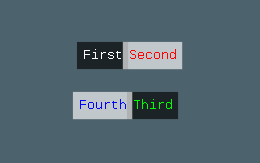

## Customizing

There are two ways in which visual logs can be customized: By providing custom rendering channels, and implementing custom log items.

### Channels

Like text logs, visual logs are organized in log channels that can be rendered into and configured separately. The basic concepts are the same, and the API is quite similar as well. There is only one builtin channel, which was already shown above: `VisualLogs.Default`. Due to the more interactive and temporary use case of visual logs, this channel is unused by core and editor, and is intended to be used by your game directly.

Still, for bigger projects and custom or third party plugins, it can make sense to use a custom log channel that can be switched on and off at runtime as needed. Like custom text log channels, they are defined by deriving a new type, only this time from the `CustomVisualLogInfo` base class:

```csharp
public class FooLog : CustomVisualLogInfo
{
	// Empty constructor, initializes base class with name and base color
	public FooLog() : base("Foo Log", ColorRgba.Red) { }
}
```

It doesn't make sense to define an icon for the channel, since there is no log view that could display it, and instead of a prefixed log ID, a base color is used. Custom log retrieval works analogous to text logs:

```csharp
VisualLogs.Get<FooLog>().DrawPoint(0.0f, 0.0f, 0.0f);
```

### Items

If the predefined set of visual log entries is not enough, it is also possible to define custom log entry renderers by deriving from the `VisualLogEntry` base class and using the `Draw<T>(T item)` visual log API instead of the type-specific shortcuts. In fact, all builtin entries are implemented in the same way, so any custom defined entries are treated exactly the same as well.

This is how the builtin point items are defined:

```csharp
public class VisualLogPointEntry : VisualLogEntry
{
	private	Vector3 pos;

	public Vector3 Pos
	{
		get { return this.pos; }
		set { this.pos = value; }
	}

	public override void Draw(Canvas target, Vector3 basePos, float baseRotation, float baseScale)
	{
		float circleRadius = 5.0f;
		float borderRadius = DefaultOutlineWidth;

		// Scale anti-proportional to perspective scale in order to keep a constant size 
		// in screen space even when actually drawing in world space.
		{
			float scale = target.DrawDevice.GetScaleAtZ(this.pos.Z + basePos.Z);
			circleRadius /= scale;
			borderRadius /= scale;
		}

		// Determine point position in target (world or screen) space when taking into
		// account the specified base transform, for example when anchored to an object.
		Vector3 circlePos = this.pos;
		MathF.TransformCoord(ref circlePos.X, ref circlePos.Y, baseRotation, baseScale);
		circlePos += basePos;

		// Draw circle
		target.State.ColorTint *= this.Color;
		target.FillCircle(
			circlePos.X, 
			circlePos.Y, 
			circlePos.Z, 
			circleRadius - borderRadius * 0.5f);

		// Draw circle outline
		target.State.DepthOffset -= 0.01f;
		target.State.ColorTint *= ColorRgba.Black;
		target.FillCircleSegment(
			circlePos.X, 
			circlePos.Y, 
			circlePos.Z, 
			circleRadius, 
			0.0f, 
			MathF.RadAngle360, 
			borderRadius);
	}
}
```