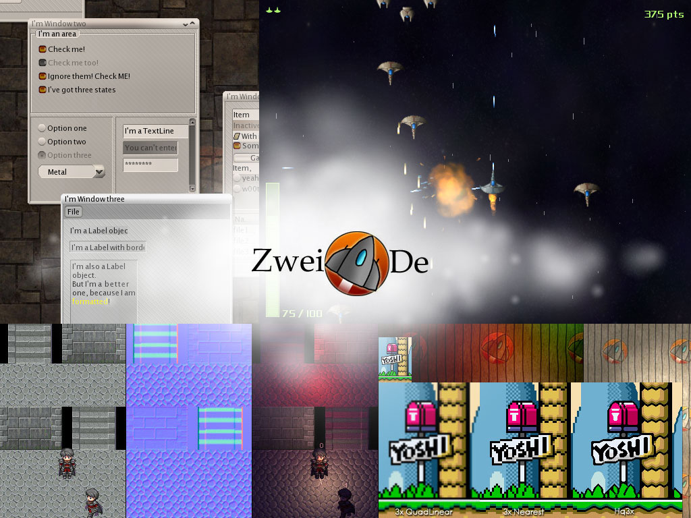
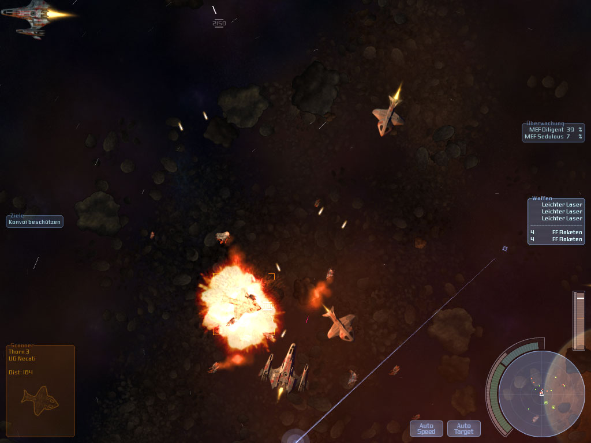
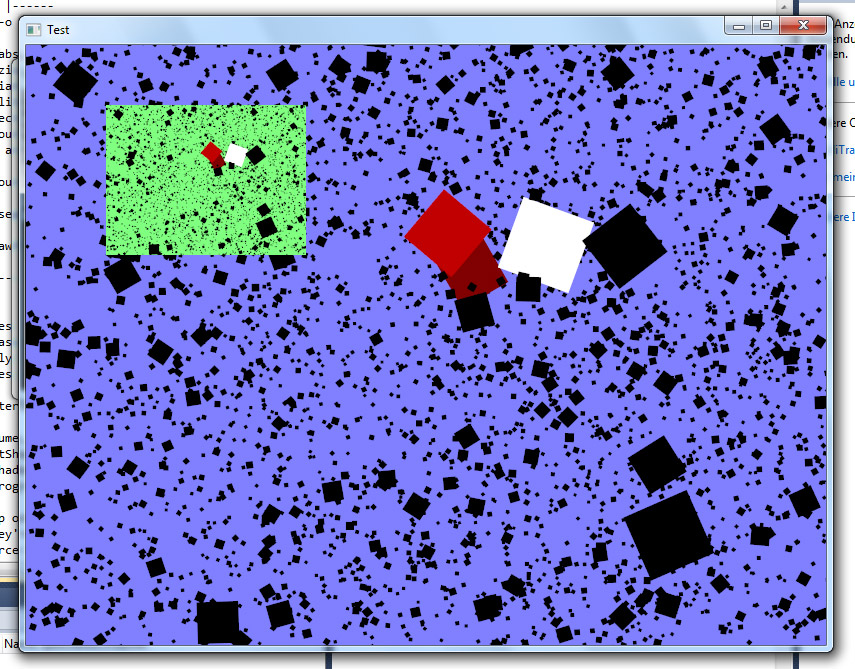
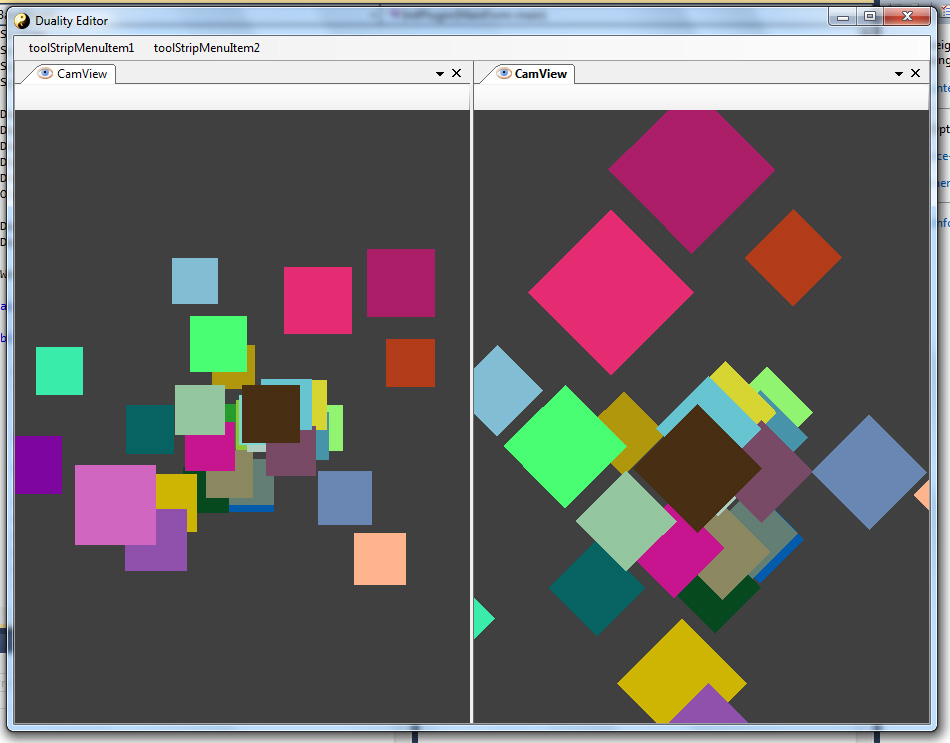
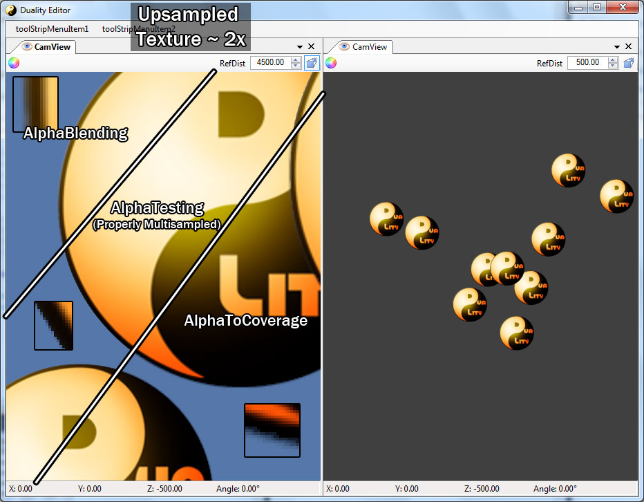
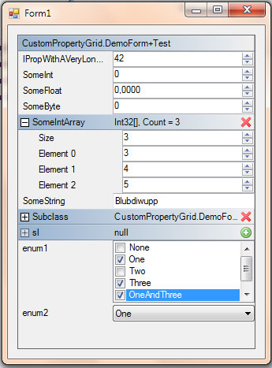
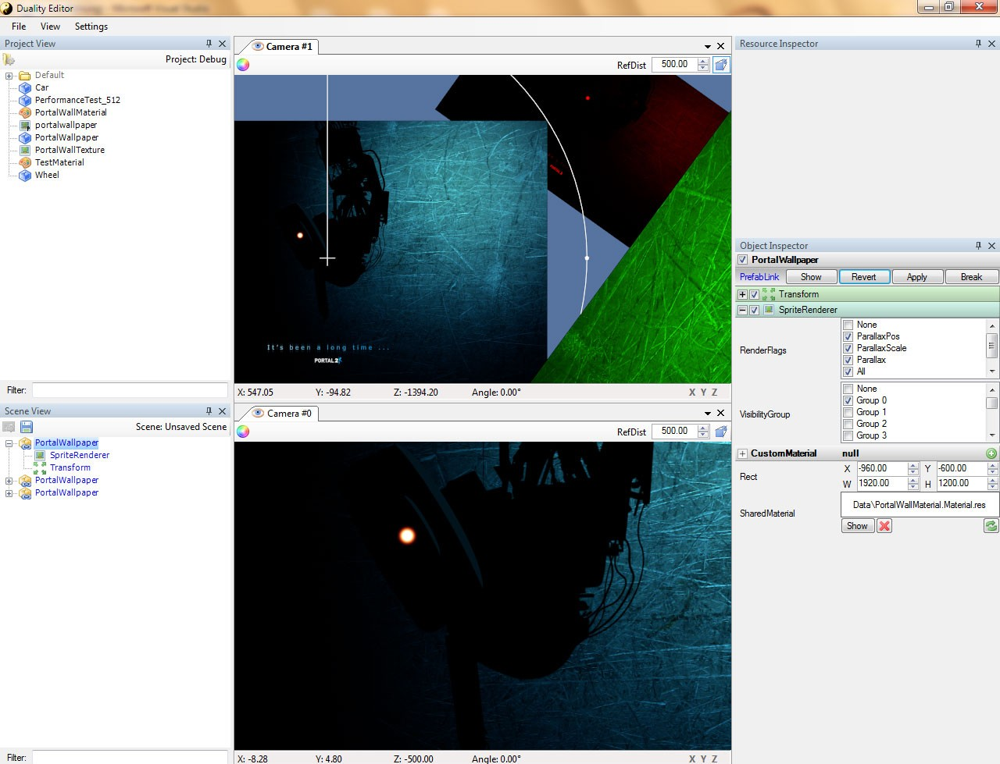
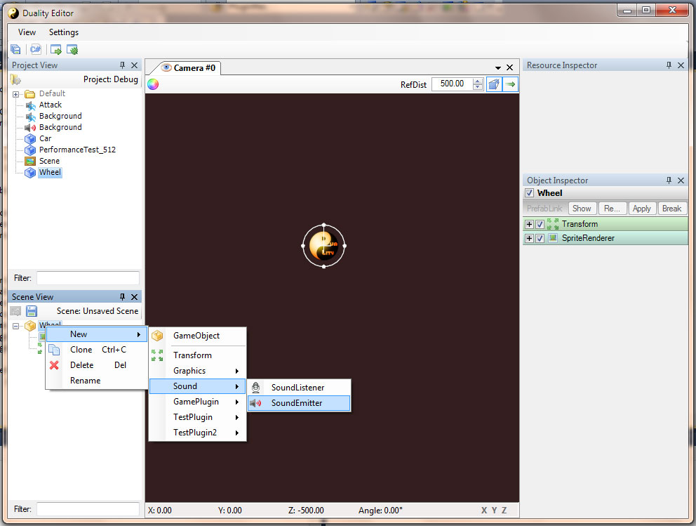
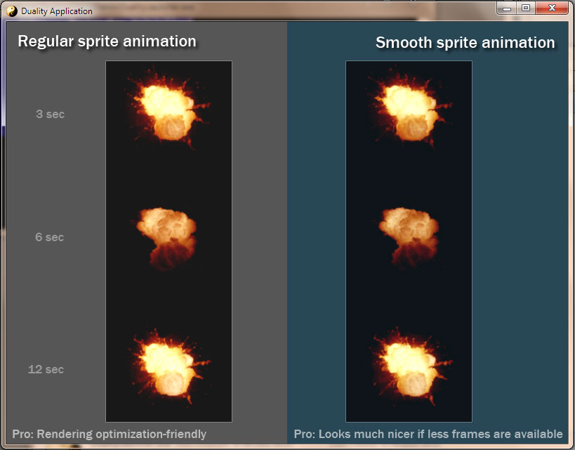
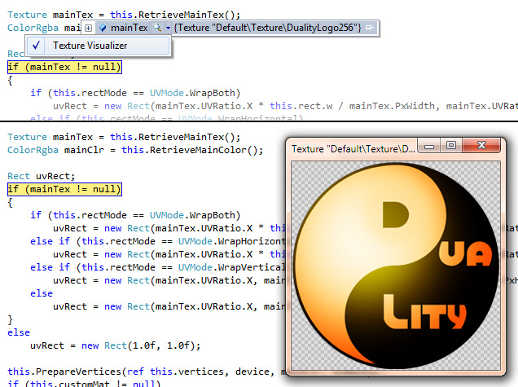

This page provides a rough overview on the pre-GitHub history of the Duality project.

  * **2009-??-??**: Finished the [ZweiDe](http://zweide.adamslair.de) engine, a 2D game development framework that could be considered a sketchy predecessor to Duality.

  

  * **2010-10-11**: Finished the [Nullpunkt](http://www.indiedb.com/games/nullpunkt-point-zero) project. Its engine and specialized editor system were based on [ZweiDe](http://zweide.adamslair.de). The decision was made to keep future engines and editor systems more flexible.
  
  

  * **2010-11-01**: Engine prototyping
  * **2010-11-20**: Launch of the [developer blog](http://blog.adamslair.de).
  * **2010-11-21**: First public appearance of the Duality project - yet without a name.
  
  
 
  * **2010-11-23**: Experimenting with serialization, cloning, logging and other basic infrastructure.
  * **2010-12-11**: Introducing plugin architecture
  * **2010-12-20**: Official announcement of the Duality project, begin of editor development.
  
  

  * **2010-12-20**: Material system, texturing, cached rendering, multisampling and other rendering related topics.
  
  

  * **2010-12-20**: Working on the Duality editor: Project View, picking techniques. 
  [[/img/ProjectVersionHistory/Duality6.jpg|width=250px)

  * **2011-03-01**: Mostly Minecraft.
  
  

  * **2011-04-11**: Prefab system design and implementation.
  * **2011-04-16**: First iteration of the custom Property Grid used in the `Object Inspector`
  
  

  * **2011-04-16**: The editor slowly takes shape: Scene View, Object Inspector and Resource Inspector added.
  
  

  * **2011-05-03**: Moved the project to [google code](https://code.google.com/archive/p/duality/) and made it open source.
  * **2011-05-25**: First public demonstration of Dualtiy via [video blog](http://www.youtube.com/watch?v=g3FmwBSEy-U).
  * **2011-06-04**: Implemented an audio subsystem based on OpenAL. Mostly a refined version of the one that was implemented in [ZweiDe](http://zweide.adamslair.de) and [Nullpunkt]([http://www.indiedb.com/games/nullpunkt-point-zero).
  
  

  * **2011-06-07**: Experimenting with smooth sprite animation techniques.
  
  

  * **2011-07-08**: Video blog: [Sprite Animation, Text Rendering, Postprocessing](http://www.youtube.com/watch?v=UVLaQoIW7D8)
  * **2011-08-11**: Video blog: [Asteroids Demo, Serialization, Metadata](http://www.youtube.com/watch?v=evF-jln3jFY)
  * **2011-08-31**: Video blog: [Documentation](http://www.youtube.com/watch?v=5b7oQXf1iQ4)
  * **2012-02-16**: Video blog: [Sandbox, Xml and Physics](http://www.youtube.com/watch?v=QzdCjVX7lVY)
  * **2012-03-21**: Rewrote the custom Property Grid, introduced intelligent drag drop and a complete editor redesign.
  [[/img/ProjectVersionHistory/Duality13.jpg|width=200px)

  * **2012-03-26**: Implemented custom Visual Studio [debugger visualizers](http://www.adamslair.de/blog/?p=616) for Duality.
  
  

  * **2012-04-29**: Ported Farseer Physics to OpenTK and (roughly) added it to the Duality framework. Created a small physics-driven [Tetris demo](https://duality.googlecode.com/svn/trunk/Other/TechDemos/Packages/Tetris.zip).
  * **2012-07-31**: Finished implementing physics and created a small [Physics demo](https://duality.googlecode.com/svn/trunk/Other/TechDemos/Packages/Physics.zip).

  [[/img/ProjectVersionHistory/Duality18.png|width=250px)[[/img/ProjectVersionHistory/Duality19.png|width=250px)

  * **2012-08-13**: Video blog: [Physical Platformer](http://www.youtube.com/watch?v=3rAB2GRJfcc)
  * **2012-08-23**: General usability tweaking in the Duality editor.

  [[/img/ProjectVersionHistory/Duality23.jpg|width=150px)[[/img/ProjectVersionHistory/Duality24.jpg|width=150px)

  * **2013-02-18**: Released a [bachelor thesis](http://bachelorthesis.adamslair.net/) dealing with the internals of Duality to the public.
  * **2013-07-21**: Moved project from [google code](https://code.google.com/p/duality/) to to GitHub.