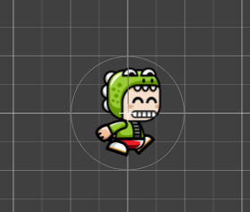

Very few games are made that don't need animations. Duality supports animations through a dedicated Component that quickly allows the creation of animations through spritesheets.

* TOC
{:toc}

# Overview

So, what is needed for an animation?
A spritesheet. A spritesheet is nothing more than a sequence of images that when shown in sequence form an animation.
So, let's just use this one (Downloaded from OpenGameArt, character created by Bevouliin):


Save it somewhere on your computer...

And open Duality.

Drag and drop the spritesheet to the project view.

Looking to the right you see a few fields that relate to animation. In our example, you see Billy six times doing different things.

Insert 3 in the AnimCols and 2 in the AnimRows. AnimFrameBorder is only if you have borders between the frames.

Create a new GameObject by right-clicking in the scene view and give it a name: Billy (I call it that)
In Billy, add a new AnimSpriteRenderer Component.


You will Duality's logo appearing. That's ok. Drag Billy's Pixmap over AnimSpriteRenderer and you'll see Billy in your scene.



Pressing play, you will see the full animation running, slowly.

By tweaking the values in AnimSpriteRenderer, you can control the animation speed, when it starts, when it ends, if it starts automatically, etc.

# Controlling Animations

So, knowing now how to create an animated character, we need to slice the spritesheet into the various segments, like walking, jumping, running, etc.

Our example has two segments that we must define so that our character doesn't just loop through every frame in the animation nonstop.

Now, let's bring Billy to life. Look closely at Billy's spritesheet and notice that the first 4 frames are of him running, and 2 are of him idle. It's important.

Now, we need to code a bit. Just open Visual Studio, rename YourCustomComponentType to BillyAnimation (for example, entirely optional).

I always implement ICmpInitializable and ICmpUpdatable in my components and then proceed to rearrange the methods, first OnActivate(), then OnUpdate() and finally, OnDeactivate().

Remove the "throw not Implemented Exception" line wherever you find it.

Then, write this on your OnActivate() method:
```csharp
DualityApp.Keyboard.KeyUp+=Keyboard_KeyUp;
PlayAnimation(4, 2);
```
So, what is going on here?

```csharp
DualityApp.Keyboard.KeyUp+=Keyboard_KeyUp;
```
Is an EventHandler we will implement so that when there is no key pressed, something will happen.

```csharp
PlayAnimation(4, 2);
```
Is a method we will implement that will simply play the animation with the values we provide.

Here is the method:
```csharp
private void PlayAnimation(int firstFrame, int frameCount)
{
	var animation = this.GameObj.GetComponent<AnimSpriteRenderer>();
	animation.AnimFirstFrame = firstFrame;
	animation.AnimFrameCount = frameCount;
}
```

As you can see, he have a very simple routine to play an animation as we please. Because we defined this on on startup if you build your solution and add the component to Billy and run your game, you'll see Billy, animated, ready to go.

Add this to the rest of your class:
```csharp
public void OnUpdate()
{
	if (DualityApp.Keyboard[Key.Right])
	{
		PlayAnimation(0, 4);
	}
}

void Keyboard_KeyUp(object sender, KeyboardKeyEventArgs e)
{
	 PlayAnimation(4, 2);
}
```

Build, and when pressing Right arrow key on your keyboard, you'll see Billy running. By releasing the key, he'll just stay in the idle position.

This is just an example of going about this.
